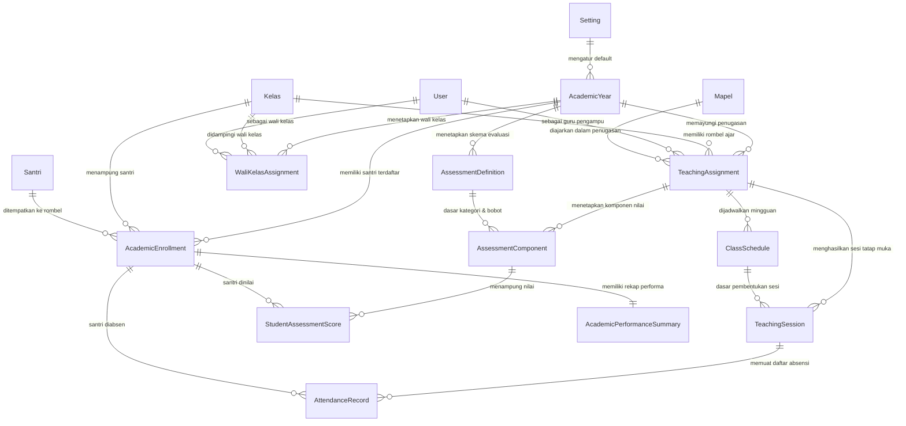
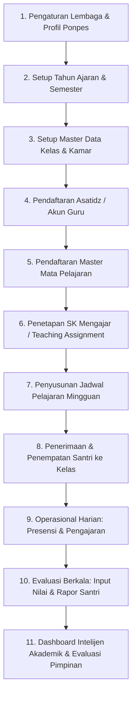
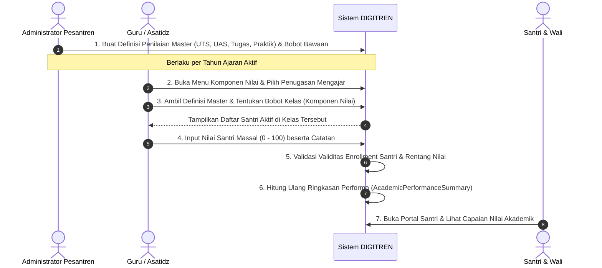
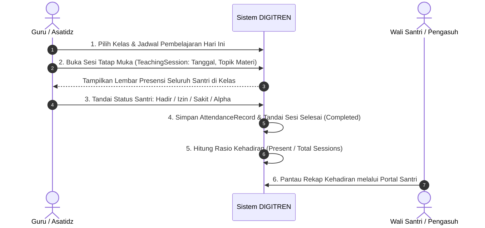
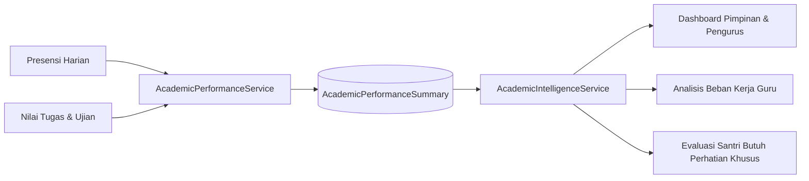

# Audit Alur Kerja & Arsitektur Domain Akademik DIGITREN

Dokumen ini merupakan hasil audit menyeluruh terhadap arsitektur domain akademik yang telah terimplementasi pada sistem informasi Pondok Pesantren Fatimah Az-Zahra (DIGITREN). Dokumen disusun dengan bahasa yang lugas dan terstruktur agar dapat dipahami oleh Administrator Pesantren, Dewan Pengurus, Asatidz/Guru, maupun pengguna non-teknis.

---

## 1. Arsitektur Domain Akademik Saat Ini

Domain akademik DIGITREN dirancang dengan pemisahan tanggung jawab (*separation of concerns*) yang jelas, mengacu pada standar kurikulum pesantren modern berbasis semester dan tahun ajaran aktif. 

Struktur domain akademik saat ini terbagi menjadi 5 pilar utama:

1. **Pilar Fondasi Akademik (*Academic Foundation*)**:
   - `AcademicYear` (Tahun Ajaran): Mengatur rentang waktu aktif kalender pendidikan (Ganjil/Genap), tanggal mulai, dan tanggal berakhir.
   - `Kelas` (Rombongan Belajar): Tingkatan kelas santri (misal: VII-A, VIII-B, Takhasus).
   - `StudentBatch` (Angkatan Santri): Kohort penerimaan santri tahunan.
   - `AcademicEnrollment` (Penempatan Akademik Santri): Menghubungkan santri dengan kelas tertentu pada tahun ajaran aktif dengan status (*Aktif, Lulus, Pindah, Drop Out*).
   - `WaliKelasAssignment` (Penugasan Wali Kelas): Menunjuk guru pembimbing kelas per tahun ajaran.

2. **Pilar Kurikulum & Penugasan (*Curriculum & Teaching Assignment*)**:
   - `Mapel` (Mata Pelajaran): Katalog mata pelajaran dengan kode unik, tingkatan, dan kategori (Agama, Umum, Kepesantrenan).
   - `TeachingAssignment` (SK Mengajar Guru): Jangkar integrasi utama yang mengaitkan Guru (`User`), Mata Pelajaran (`Mapel`), Kelas (`Kelas`), dan Tahun Ajaran (`AcademicYear`).

3. **Pilar Operasional Pembelajaran (*Operational & Attendance*)**:
   - `ClassSchedule` (Jadwal Pembelajaran Mingguan): Hari, jam mulai, jam selesai, dan ruangan belajar.
   - `TeachingSession` (Sesi Perkuliahan/Tatap Muka Harian): Catatan riil pelaksanaan tatap muka, memuat tanggal sesi, topik materi kajian, catatan kendala, dan status (*Planned, Completed, Cancelled*).
   - `AttendanceRecord` (Presensi Santri): Catatan absensi santri per sesi belajar dengan status baku (*Hadir, Izin, Sakit, Alpha*).

4. **Pilar Evaluasi & Penilaian (*Assessment & Grading*)**:
   - `AssessmentDefinition` (Master Kategori Penilaian): Master jenis ujian tingkat institusi per tahun ajaran (UTS, UAS, Tugas, Praktik, Ulangan Harian, Lainnya) beserta bobot standar persentase.
   - `AssessmentComponent` (Komponen Nilai Kelas): Instansiasi kategori penilaian yang diambil oleh guru pengampu per penugasan mengajar (`TeachingAssignment`).
   - `StudentAssessmentScore` (Daftar Nilai Santri): Nilai kuantitatif santri (skala 0.00 – 100.00) dengan tanggal penilaian (*graded_at*) dan identitas penilai (*graded_by*).

5. **Pilar Analitik & Kecerdasan Akademik (*Academic Intelligence & Performance*)**:
   - `AcademicPerformanceSummary`: Rekapitulasi terindeks per santri yang menghitung tingkat kehadiran (*attendance rate*), jumlah komponen yang sudah dinilai, total bobot, rata-rata nilai berbobot (*weighted score*), serta status kalkulasi (*Kosong, Sebagian, Lengkap*).
   - `AcademicIntelligenceService` & `AcademicKpiService`: Mesin penghitung analitik, distribusi nilai, beban mengajar guru (*teacher workload*), dan komparasi performa antar-tahun ajaran.

---

## 2. Hubungan Antar-Entitas (*Entity Relationships*)

Diagram konseptual berikut menunjukkan relasi struktural antar-entitas data dalam domain akademik:

---

## 3. Alur Kerja dari Sistem Kosong Hingga Operasional Harian

Bagi lembaga pesantren yang baru mengadopsi DIGITREN, urutan inisialisasi sistem harus dilakukan secara berurutan agar integritas data tetap terjaga:

### Penjelasan Tahapan:
1. **Pengaturan Lembaga (`Setting`)**: Mengisi identitas resmi pesantren, nama pimpinan, nomor kontak, logo, serta alamat resmi yang akan digunakan pada kop laporan dan rapor.
2. **Setup Tahun Ajaran (`AcademicYear`)**: Mendefinisikan tahun ajaran aktif (misal: 2026/2027 Ganjil). Hanya boleh ada 1 tahun ajaran dengan status `is_active = true`.
3. **Setup Kelas (`Kelas`)**: Membentuk rombongan belajar (contoh: Tingkat 7 Kelas A, Tingkat 7 Kelas B, Takhasus Kitab Kuning).
4. **Pendaftaran Guru (`User` ber-role Guru)**: Membuat akun guru dan melengkapi data kepegawaian asatidz.
5. **Katalog Mata Pelajaran (`Mapel`)**: Mendaftarkan kitab/pelajaran yang diajarkan (contoh: Fiqih Fathul Qorib, Nahwu Jurumiyah, Bahasa Arab, Matematika).
6. **Penetapan Penugasan Mengajar (`TeachingAssignment`)**: Mengunci kombinasi: *Siapa gurunya*, *Mengajar apa*, *Di kelas mana*, dan *Pada tahun ajaran apa*.
7. **Jadwal Pelajaran (`ClassSchedule`)**: Mengalokasikan hari dan jam belajar per penugasan mengajar.
8. **Penempatan Santri (`AcademicEnrollment`)**: Menempatkan santri aktif ke dalam kelas rombel yang sesuai untuk tahun ajaran tersebut.
9. **Operasional Harian (`TeachingSession` & `AttendanceRecord`)**: Asatidz mengisi jurnal tatap muka harian dan merekam kehadiran santri.
10. **Evaluasi Akademik (`AssessmentComponent` & `StudentAssessmentScore`)**: Guru membuat komponen nilai dan menginput nilai santri secara teratur.
11. **Analitik & Intelijen (`AcademicIntelligenceService`)**: Pengurus memantau ringkasan performa santri dan kedisiplinan mengajar secara *real-time*.

---

## 4. Alur Kerja Penilaian Eksisting (*Assessment Flow*)

Alur penilaian di DIGITREN telah menerapkan pembagian wewenang yang aman dan sistematis:

### Aturan Bisnis Penting Penilaian:
- **Rentang Nilai**: Wajib berada pada skala angka desimal `0.00` hingga `100.00`.
- **Integritas Penempatan**: Santri yang dinilai harus berstatus `Aktif` pada kelas dan tahun ajaran penugasan mengajar tersebut.
- **Keamanan Audit**: Setiap nilai mencatat user penilai (`graded_by`) dan waktu penilaian (`graded_at`).
- **Penghapusan Aman**: Definisi penilaian yang sudah memiliki komponen nilai atau riwayat nilai santri tidak akan dihapus keras (*hard delete*), melainkan dinonaktifkan (`is_active = false`) demi menjaga arsip nilai historis.

---

## 5. Alur Kerja Presensi Eksisting (*Attendance Flow*)

Presensi santri terikat langsung dengan aktivitas tatap muka pembelajaran:

### Logika Penghitungan Kehadiran:
$$\text{Attendance Rate (\%)} = \left(\frac{\text{Jumlah Sesi Hadir}}{\text{Total Sesi Tatap Muka Terlaksana}}\right) \times 100\%$$
- Status `Izin` dan `Sakit` tercatat resmi sebagai keterangan ketidakhadiran berizin.
- Status `Alpha` dihitung sebagai pelanggaran disiplin yang memengaruhi skor performa santri di dashboard pengasuhan.

---

## 6. Alur Kerja Kecerdasan Akademik (*Academic Intelligence Flow*)

Sistem DIGITREN dilengkapi modul analitik otomatis yang merangkum data operasional harian menjadi wawasan strategis:

### Kategori Status Performa Santri:
1. **Kosong**: Belum ada sesi presensi dan belum ada komponen nilai yang diinput.
2. **Sebagian**: Sesi atau nilai telah diinput sebagian, atau tingkat kehadiran masih di bawah 75%.
3. **Lengkap**: Seluruh komponen penilaian terisi lengkap, memiliki riwayat sesi, dan tingkat kehadiran $\ge 75\%$.

---

## 7. Analisis Celah & Gap Menuju LMS (*Pre-LMS Gap Analysis*)

Meskipun fondasi akademik DIGITREN saat ini sudah sangat kokoh untuk administrasi, jadwal, presensi, dan penilaian, ditemukan beberapa keterbatasan fungsional sebelum modul Learning Management System (LMS) diterapkan:

| Area Fungsional | Kondisi Saat Ini di DIGITREN | Kebutuhan Modul LMS Pesantren | Kesiapan Arsitektur |
| :--- | :--- | :--- | :--- |
| **Penyimpanan Bahan Ajar** | Belum ada entitas penyimpanan materi. Guru hanya menulis judul materi singkat di kolom `topic` pada tabel `teaching_sessions`. | Guru membutuhkan repositori materi terstruktur (PDF kitab, dokumen ringkasan, tautan kajian YouTube, artikel web) per mata pelajaran dan kelas. | **Perlu Entitas Baru**: `learning_materials` & `learning_material_files`. |
| **Akses Bahan oleh Santri** | Santri hanya melihat riwayat topik yang telah lewat di portal santri, tidak bisa mengunduh bahan bacaan/kitab. | Santri dapat membuka perpustakaan materi (*Learning Library*), membaca modul secara mandiri, dan mengunduh berkas PDF pegangan. | **Perlu Tampilan Baru**: Portal Santri Tab "Materi Belajar". |
| **Pemisahan Sumber Belajar vs Nilai** | Beberapa pengguna menyamakan istilah "Tugas" antara bahan ajar dengan komponen nilai. | Perlu pemisahan tegas: Materi belajar adalah sumber literasi mandiri, sedangkan Asesmen/Nilai adalah instrumen evaluasi terukur. | **Arsitektur Jelas**: LMS murni modul literasi, tidak merombak tabel `student_assessment_scores`. |
| **Konteks Multi-Kelas** | Guru mengajar Fiqih di Kelas VII-A dan VII-B secara terpisah. Jika ada 1 materi yang sama, belum ada cara berbagi materi tanpa duplikasi. | Fleksibilitas penargetan materi: 1 materi ajar dapat ditargetkan ke beberapa kelas sekaligus yang diampu oleh guru tersebut. | **Perlu Entitas Penargetan**: `learning_material_targets`. |
| **Dukungan Kuota & Offline Santri** | Belum ada panduan kompresi berkas atau pemanfaatan tautan eksternal. | Pesantren memiliki keterbatasan bandwidth internet; materi harus mendukung tautan eksternal (Google Drive / YouTube) dan pembatasan ukuran berkas lokal (maks 10MB). | **Perlu Storage Strategy**: Validasi MIME type, ukuran berkas, dan sanitasi URL. |

---

## Kesimpulan Audit
Arsitektur akademik DIGITREN telah berada pada status **siap dan matang (*production grade*)**. Fondasi penugasan mengajar (`TeachingAssignment`) merupakan jangkar yang sangat ideal untuk menopang modul LMS sederhana tanpa mengganggu alur presensi maupun penilaian yang sudah berjalan stabil.
