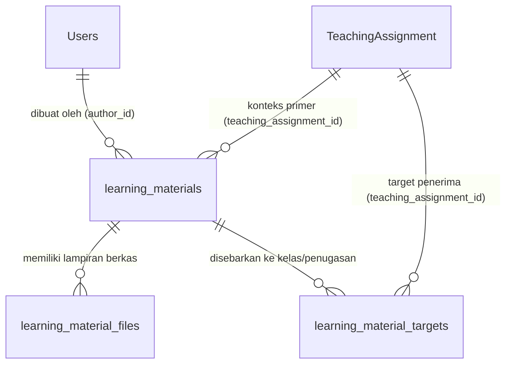

# Proposal Desain Basis Data Manajemen Pembelajaran (LMS Database Proposal)

Dokumen ini memuat proposal teknis perancangan skema basis data untuk modul *Learning Management System* (LMS) DIGITREN. Proposal ini dirancang sesuai standar **Laravel 12**, mematuhi prinsip normalisasi basis data, dan kompatibel penuh dengan pola arsitektur **Service Layer Pattern** yang diterapkan pada repositori ini.

> [!NOTE]
> Dokumen ini adalah **rancangan arsitektur murni (*design proposal*)**. Tidak ada *migration* atau perubahan skema database riil yang dieksekusi pada fase ini.

---

## 1. Diagram Relasi Entitas (ERD Proposal)

---

## 2. Rincian Entitas & Rekomendasi Kolom

### 2.1 Entitas `learning_materials`
Tabel utama yang menyimpan rekaman kepala dan konten materi ajar yang disusun oleh guru.

| Nama Kolom | Tipe Data | Nullable | Keterangan & Aturan Bisnis |
| :--- | :--- | :---: | :--- |
| `id` | `BIGINT UNSIGNED` | Tidak | Kunci primer (Auto Increment). |
| `teaching_assignment_id` | `BIGINT UNSIGNED` | Tidak | Foreign key ke `teaching_assignments.id` (konteks penugasan pembuat). |
| `author_id` | `BIGINT UNSIGNED` | Tidak | Foreign key ke `users.id` (guru pembuat materi). |
| `title` | `VARCHAR(255)` | Tidak | Judul materi (misal: "Bab Wudhu: Syarat dan Rukun"). |
| `slug` | `VARCHAR(255)` | Ya | Slug URL ramah SEO untuk navigasi. |
| `description` | `TEXT` | Ya | Ringkasan singkat intisari materi. |
| `content` | `LONGTEXT` | Ya | Teks lengkap materi kajian (mendukung format HTML/Markdown). |
| `external_url` | `VARCHAR(500)` | Ya | Tautan tautan referensi web luar atau Google Drive. |
| `video_url` | `VARCHAR(500)` | Ya | Tautan video kajian (YouTube, Vimeo, atau media luar). |
| `status` | `ENUM('Draft', 'Published', 'Archived')` | Tidak | Status materi. Nilai baku: `Draft`. |
| `published_at` | `TIMESTAMP` | Ya | Tanggal dan waktu publikasi resmi ke santri. |
| `created_at` | `TIMESTAMP` | Ya | Cap waktu pembuatan data. |
| `updated_at` | `TIMESTAMP` | Ya | Cap waktu pembaruan data. |

---

### 2.2 Entitas `learning_material_files`
Tabel yang mencatat berkas fisik (dokumen PDF, Word, Presentasi) yang dilampirkan pada materi.

| Nama Kolom | Tipe Data | Nullable | Keterangan & Aturan Bisnis |
| :--- | :--- | :---: | :--- |
| `id` | `BIGINT UNSIGNED` | Tidak | Kunci primer (Auto Increment). |
| `learning_material_id` | `BIGINT UNSIGNED` | Tidak | Foreign key ke `learning_materials.id` (Cascade on Delete). |
| `file_name` | `VARCHAR(255)` | Tidak | Nama asli berkas saat diunggah (misal: "Kitab_Fathul_Qorib_Bab_Thoharoh.pdf"). |
| `file_path` | `VARCHAR(500)` | Tidak | Lokasi berkas relatif pada disk penyimpanan (misal: `materials/2026/09/uuid.pdf`). |
| `file_type` | `VARCHAR(100)` | Tidak | MIME type berkas (misal: `application/pdf`). |
| `file_size` | `BIGINT UNSIGNED` | Tidak | Ukuran berkas dalam satuan bita (*bytes*). |
| `download_count` | `INT UNSIGNED` | Tidak | Pencatat jumlah unduhan santri (Bawaan: `0`). |
| `created_at` | `TIMESTAMP` | Ya | Cap waktu unggah berkas. |
| `updated_at` | `TIMESTAMP` | Ya | Cap waktu pembaruan metadata berkas. |

---

### 2.3 Entitas `learning_material_targets`
Tabel pivot pendukung untuk skenario multi-kelas (misal: satu guru mengajar Fiqih di Kelas VII-A dan VII-B, materi yang sama dapat dibagikan ke kedua kelas tanpa menduplikasi berkas fisik).

| Nama Kolom | Tipe Data | Nullable | Keterangan & Aturan Bisnis |
| :--- | :--- | :---: | :--- |
| `id` | `BIGINT UNSIGNED` | Tidak | Kunci primer (Auto Increment). |
| `learning_material_id` | `BIGINT UNSIGNED` | Tidak | Foreign key ke `learning_materials.id` (Cascade on Delete). |
| `teaching_assignment_id` | `BIGINT UNSIGNED` | Tidak | Foreign key ke `teaching_assignments.id` penerima materi. |
| `created_at` | `TIMESTAMP` | Ya | Cap waktu penargetan. |
| `updated_at` | `TIMESTAMP` | Ya | Cap waktu pembaruan penargetan. |

---

## 3. Rekomendasi Pengindeksan (*Index Optimization*)

Untuk memastikan performa kueri tetap instan saat data materi dan riwayat bertumbuh besar:

1. **Pada Tabel `learning_materials`**:
   - `INDEX idx_materials_author (author_id)`: Mempercepat kueri daftar materi buatan guru saat membuka portal guru.
   - `INDEX idx_materials_assignment_status (teaching_assignment_id, status)`: Mempercepat pencarian materi berstatus *Published* untuk suatu penugasan mengajar.
   - `INDEX idx_materials_published_at (published_at DESC)`: Mengoptimalkan pengurutan materi terbaru pada portal santri.

2. **Pada Tabel `learning_material_targets`**:
   - `UNIQUE KEY uq_material_target (learning_material_id, teaching_assignment_id)`: Menghindari duplikasi penargetan materi ke penugasan kelas yang sama.
   - `INDEX idx_target_assignment (teaching_assignment_id)`: Mempercepat kueri gabungan (*JOIN*) santri untuk menemukan seluruh materi yang ditujukan ke rombel kelasnya.

3. **Pada Tabel `learning_material_files`**:
   - `INDEX idx_files_material (learning_material_id)`: Mempercepat pengambilan daftar lampiran saat materi dibuka.

---

## 4. Pertimbangan Otorisasi & Keamanan (*Policy Considerations*)

Sesuai standar Laravel 12 dan Policy Pattern:
1. **Guru (`LearningMaterialPolicy`)**:
   - `view`: Guru dapat melihat materi jika ia adalah pemilik materi (`author_id == user.id`) atau rekan pengajar di mapel yang sama.
   - `create`: Hanya pengguna dengan peran `Guru` yang memiliki penugasan mengajar aktif (`TeachingAssignment`) yang diizinkan membuat materi.
   - `update` & `delete`: Hanya pemilik materi (`author_id == user.id`) atau `Administrator` yang berhak menyunting atau menghapus materi tersebut.
2. **Santri (`LearningMaterialPolicy`)**:
   - `view`: Santri hanya dapat membuka materi jika materi tersebut berstatus `Published` DAN penugasan mengajar materi tersebut menargetkan kelas di mana santri terdaftar aktif (`AcademicEnrollment.kelas_id`).
   - `download`: Berkas lampiran dilindungi oleh rute unduh privat bertanda tangan (*signed URL* atau *stream controller*) untuk mencegah akses berkas tanpa izin (*direct link scraping*).

---

## 5. Strategi Penyimpanan Berkas (*Storage Strategy*)

1. **Lokasi Penyimpanan**:
   - Berkas diunggah ke *disk* privat Laravel: `storage/app/private/materials/{tahun}/{bulan}/`.
   - Mengapa privat? Untuk mencegah dokumen internal pesantren dan lembar kajian dapat diakses bebas oleh bot pencari publik tanpa login.
2. **Validasi Berkas Ketat**:
   - Format yang diizinkan: `PDF`, `DOCX`, `DOC`, `XLSX`, `PPTX`, `JPG`, `PNG`.
   - Ukuran maksimal berkas lokal: **10 MB per berkas**.
   - Dokumen besar (>10 MB) atau video kajian wajib diarahkan menggunakan tautan eksternal (`external_url` atau `video_url`) seperti Google Drive atau YouTube.
3. **Pembersihan Berkas Bersih (*Clean Garbage Disposal*)**:
   - Ketika rekaman `learning_material_files` dihapus dari database, *Service Layer* (`LearningMaterialService`) bertugas menghapus fisik berkas dari disk penyimpanan lokal agar tidak meninggalkan berkas sampah (*orphaned files*).
