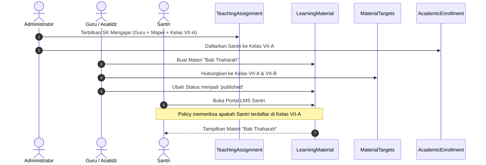

# Desain Otorisasi & Kebijakan Akses LMS (LMS Authorization Design)

Dokumen ini memaparkan rancangan kebijakan keamanan dan otorisasi akses (*authorization design*) untuk modul *Learning Management System* (LMS) DIGITREN. Seluruh mekanisme otorisasi mematuhi pola resmi **Laravel Policy Pattern**, terintegrasi dengan peran pengguna Spatie Permissions, serta menegakkan prinsip *least privilege* demi melindungi materi ajar pesantren.

---

## 1. Matriks Hak Akses Peran Pengguna (Role-Permission Matrix)

Berikut adalah pemetaan hak akses untuk setiap peran pengguna di lingkungan pesantren terhadap entitas materi pembelajaran:

| Aksi / Kemampuan (*Ability*) | Administrator | Dewan Pengurus | Guru / Asatidz | Santri / Siswa | Staf Keuangan |
| :--- | :---: | :---: | :---: | :---: | :---: |
| **Lihat Daftar Materi (`viewAny`)** | ✅ Ya (Semua) | ✅ Ya (Monitoring) | ✅ Ya (Materi Sendiri) | ✅ Ya (Kelas Sendiri) | ❌ Tidak |
| **Buka Detail Materi (`view`)** | ✅ Ya (Semua) | ✅ Ya (Semua) | ✅ Ya (Pemilik/Mapel) | ✅ Ya (Hanya Published) | ❌ Tidak |
| **Buat Materi Baru (`create`)** | ✅ Ya | ❌ Tidak | ✅ Ya (Jika ada SK) | ❌ Tidak | ❌ Tidak |
| **Sunting Materi (`update`)** | ✅ Ya | ❌ Tidak | ✅ Ya (Milik Sendiri) | ❌ Tidak | ❌ Tidak |
| **Hapus Materi (`delete`)** | ✅ Ya | ❌ Tidak | ✅ Ya (Milik Sendiri) | ❌ Tidak | ❌ Tidak |
| **Terbitkan Materi (`publish`)** | ✅ Ya | ❌ Tidak | ✅ Ya (Milik Sendiri) | ❌ Tidak | ❌ Tidak |
| **Arsipkan Materi (`archive`)** | ✅ Ya | ❌ Tidak | ✅ Ya (Milik Sendiri) | ❌ Tidak | ❌ Tidak |
| **Unggah Lampiran (`uploadAttachment`)**| ✅ Ya | ❌ Tidak | ✅ Ya (Milik Sendiri) | ❌ Tidak | ❌ Tidak |
| **Unduh Berkas PDF (`downloadFile`)** | ✅ Ya | ✅ Ya | ✅ Ya | ✅ Ya (Kelas Target) | ❌ Tidak |

---

## 2. Alur Integrasi Akademik & Titik Akses Materi

Mekanisme akses materi pembelajaran terhubung secara otomatis ke struktur akademik aktif:



---

## 3. Desain Kode Kebijakan: `LearningMaterialPolicy`

Berikut adalah spesifikasi implementasi kelas `LearningMaterialPolicy` yang akan ditempatkan pada `app/Policies/LearningMaterialPolicy.php`:

```php
<?php

namespace App\Policies;

use App\Models\AcademicEnrollment;
use App\Models\LearningMaterial;
use App\Models\TeachingAssignment;
use App\Models\User;
use Illuminate\Auth\Access\HandlesAuthorization;

class LearningMaterialPolicy
{
    use HandlesAuthorization;

    /**
     * Administrator bypass: Administrator memiliki hak akses penuh atas semua materi.
     */
    public function before(User $user, string $ability): ?bool
    {
        if ($user->hasRole('Administrator')) {
            return true;
        }

        return null;
    }

    /**
     * Menentukan apakah pengguna dapat melihat daftar materi.
     */
    public function viewAny(User $user): bool
    {
        // Guru, Pengurus, dan Santri diizinkan membuka antarmuka katalog materi
        return $user->hasAnyRole(['Guru', 'Pengurus', 'Santri']);
    }

    /**
     * Menentukan apakah pengguna dapat melihat dan membaca materi tertentu.
     */
    public function view(User $user, LearningMaterial $material): bool
    {
        // 1. Dewan Pengurus memiliki akses baca untuk fungsi supervisi akademik
        if ($user->hasRole('Pengurus')) {
            return true;
        }

        // 2. Guru pemilik materi selalu dapat melihat materinya sendiri
        if ($user->hasRole('Guru')) {
            if ($material->teacher_id === $user->id) {
                return true;
            }

            // Guru sesama pengampu mata pelajaran yang sama diizinkan melihat referensi (Read-Only)
            $teachesSameMapel = TeachingAssignment::where('user_id', $user->id)
                ->where('mapel_id', $material->mapel_id)
                ->where('status', TeachingAssignment::STATUS_AKTIF)
                ->exists();

            return $teachesSameMapel && $material->status === 'published';
        }

        // 3. Santri hanya boleh melihat jika materi berstatus Published dan kelasnya ditargetkan
        if ($user->hasRole('Santri')) {
            if ($material->status !== 'published') {
                return false;
            }

            // Dapatkan santri_id dari user login
            $santriId = $user->santri?->id ?? $user->santri_id;
            if (!$santriId) {
                return false;
            }

            // Periksa pendaftaran aktif santri di tahun ajaran materi
            $activeClassIds = AcademicEnrollment::where('santri_id', $santriId)
                ->where('academic_year_id', $material->academic_year_id)
                ->where('status', AcademicEnrollment::STATUS_AKTIF)
                ->pluck('kelas_id')
                ->toArray();

            // Periksa apakah kelas santri termasuk dalam target materi
            return $material->targets()
                ->whereIn('kelas_id', $activeClassIds)
                ->exists();
        }

        return false;
    }

    /**
     * Menentukan apakah pengguna dapat membuat materi baru.
     */
    public function create(User $user): bool
    {
        if (!$user->hasRole('Guru')) {
            return false;
        }

        // Guru hanya boleh membuat materi jika memiliki minimal satu SK Mengajar aktif
        return TeachingAssignment::where('user_id', $user->id)
            ->where('status', TeachingAssignment::STATUS_AKTIF)
            ->exists();
    }

    /**
     * Menentukan apakah pengguna dapat memperbarui materi.
     */
    public function update(User $user, LearningMaterial $material): bool
    {
        // Hanya guru pemilik materi yang diizinkan melakukan penyuntingan
        return $user->hasRole('Guru') && $material->teacher_id === $user->id;
    }

    /**
     * Menentukan apakah pengguna dapat menghapus materi.
     */
    public function delete(User $user, LearningMaterial $material): bool
    {
        // Hanya guru pemilik materi yang diizinkan menghapus
        return $user->hasRole('Guru') && $material->teacher_id === $user->id;
    }

    /**
     * Menentukan apakah pengguna dapat menerbitkan materi ke santri.
     */
    public function publish(User $user, LearningMaterial $material): bool
    {
        return $user->hasRole('Guru') && $material->teacher_id === $user->id;
    }

    /**
     * Menentukan apakah pengguna dapat mengarsipkan materi.
     */
    public function archive(User $user, LearningMaterial $material): bool
    {
        return $user->hasRole('Guru') && $material->teacher_id === $user->id;
    }

    /**
     * Menentukan apakah pengguna dapat mengunggah berkas lampiran pada materi.
     */
    public function uploadAttachment(User $user, LearningMaterial $material): bool
    {
        return $user->hasRole('Guru') && $material->teacher_id === $user->id;
    }

    /**
     * Menentukan apakah santri diizinkan mengunduh berkas fisik materi.
     */
    public function downloadFile(User $user, LearningMaterial $material): bool
    {
        return $this->view($user, $material);
    }
}
```

---

## 4. Otorisasi Unduhan Berkas yang Aman (*Secure Download Route*)

Untuk mencegah akses berkas ilegal tanpa melewati autentikasi (*Direct URL bypass / Hotlinking*):

1. **Berkas Tidak Disimpan di Folder `public/`**:
   - Seluruh lampiran materi ajar disimpan di `storage/app/materials/` yang **tidak memiliki tautan simbolik (*symlink*) langsung**.
2. **Pengunduhan Lewat Rute Bertanda Tangan & Ber-Policy**:
   - URL unduh diarahkan ke *controller method*:
     `GET /lms/materials/{material}/files/{file}/download`
   - Controller memanggil `$this->authorize('downloadFile', $material)`.
   - Hanya jika lolos otorisasi, file direspons via `Storage::download()`.
3. **Pencatatan Unduhan Otomatis**:
   - Saat file berhasil direspons, kolom `download_count` pada tabel `learning_material_files` di-inkremen secara atomik (`increment('download_count')`).

---

## 5. Hubungan Tegas Antara LMS dan Modul Penilaian (*Assessment*)

> [!IMPORTANT]
> **Prinsip Kunci: LMS Tidak Menggantikan Modul Penilaian (*No Assessment Replacement*)**

Di beberapa sistem edukasi modern, materi sering kali digabungkan dengan kuis otomatis (*integrated quiz*). Namun di DIGITREN, arsitektur memisahkan secara tegas:
- **LMS Domain**: Berfokus murni pada **Penyampaian Konten & Pustaka Belajar** (*Content Delivery & Digital Library*).
- **Assessment Domain**: Berfokus murni pada **Pengukuran Akademik Formal** (*Academic Measurement & Grading*).

Struktur evaluasi tetap berpegang teguh pada hirarki yang ada:
```
AssessmentDefinition (UTS, UAS, Tugas, Praktik)
        │
        ▼
AssessmentComponent (Bobot Komponen per SK Mengajar)
        │
        ▼
StudentAssessmentScore (Nilai Riil per Santri)
        │
        ▼
AcademicPerformanceSummary (Rekap Nilai Rata-rata Tertimbang)
```

### Opsi Integrasi di Masa Depan:
1. **Opsi A: LMS Independen (Direkomendasikan)**:
   - Modul materi berdiri sendiri sebagai bahan bacaan. Guru menilai santri melalui ujian tulis, lisan, atau tugas sorogan fisik.
   - **Kelebihan**: Sangat stabil, tidak membebani server dengan penilaian kuis otomatis, cocok dengan tradisi pesantren.
2. **Opsi B: Aktivitas LMS Berkontribusi ke Penilaian**:
   - Keaktifan membaca materi (lewat `learning_material_views`) dapat dihitung sebagai poin keaktifan pada `AssessmentComponent` bertipe "Tugas" atau "Keaktifan".
   - **Keputusan**: Diterapkan sebagai opsi opsional pada Fase 5.8.14+ setelah modul dasar terbukti andal.
