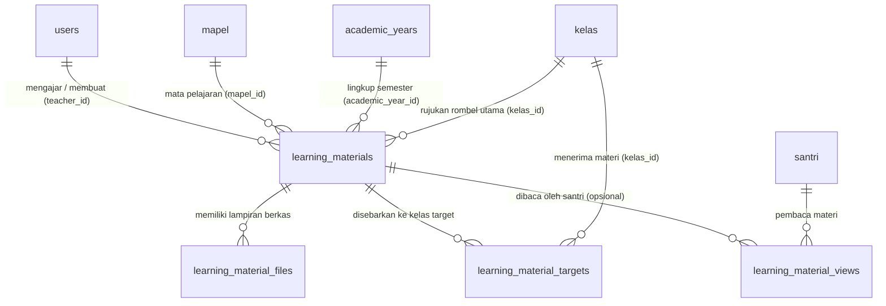

# Desain Skema Basis Data LMS & Manajemen Bahan Ajar

Dokumen ini memuat spesifikasi teknis lengkap rancangan skema basis data modul *Learning Management System* (LMS) untuk platform DIGITREN. Desain ini mengikuti kaidah normalisasi relasional, praktik terbaik Laravel 12, pengindeksan berkinerja tinggi, dan pemisahan tanggung jawab (*Separation of Concerns*).

> [!IMPORTANT]
> **Status Fase 5.8.9: Perancangan Arsitektur Saja (*Architecture & Design Only*)**  
> Sesuai batasan fase, **tidak ada berkas migrasi yang dibuat atau dijalankan pada fase ini**. Seluruh skema di bawah ini merupakan cetak biru resmi yang akan diimplementasikan pada Fase 5.8.10.

---

## 1. Diagram Relasi Entitas LMS (ERD)



---

## 2. Klasifikasi Status Tabel: Wajib vs Opsional

Dalam implementasi modul LMS DIGITREN, struktur tabel diklasifikasikan menjadi dua kelompok:

| Nama Tabel | Status | Alasan & Urgensi Arsitektural |
| :--- | :---: | :--- |
| **`learning_materials`** | **WAJIB** | Entitas kepala (*aggregate root*) yang menyimpan metadata, konten bacaan, tautan eksternal/video, serta status publikasi materi ajar. |
| **`learning_material_files`** | **WAJIB** | Normalisasi penyimpanan berkas fisik (PDF kitab, dokumen Word, modul ringkasan). Memisahkan berkas dari tabel utama mencegah pembengkakan memori saat pembacaan daftar materi (*table scan optimization*). |
| **`learning_material_targets`** | **WAJIB** | Tabel pemetaan visibilitas multi-kelas. Memungkinkan 1 materi dibagikan ke banyak rombel kelas paralel tanpa menduplikasi data atau berkas fisik. |
| **`learning_material_views`** | **OPSIONAL** *(Ditunda ke Fase Lanjutan)* | Mencatat riwayat pembacaan materi per santri. **Ditunda** untuk menghindari beban kueri penulisan (*high write load*) pada server lokal pesantren setiap kali santri membuka halaman materi. |

---

## 3. Spesifikasi Rinci Tabel Basis Data

### 3.1 Tabel Utama: `learning_materials` (Wajib)
Tabel ini merupakan sumber data utama bagi setiap modul materi yang dibuat oleh asatidz.

```sql
CREATE TABLE `learning_materials` (
    `id` BIGINT UNSIGNED NOT NULL AUTO_INCREMENT,
    `teacher_id` BIGINT UNSIGNED NOT NULL,
    `mapel_id` BIGINT UNSIGNED NOT NULL,
    `kelas_id` BIGINT UNSIGNED NULL,
    `academic_year_id` BIGINT UNSIGNED NOT NULL,
    `title` VARCHAR(255) NOT NULL,
    `slug` VARCHAR(255) NOT NULL,
    `description` TEXT NULL,
    `content_type` ENUM('text', 'pdf', 'video', 'link', 'mixed') NOT NULL DEFAULT 'text',
    `content` LONGTEXT NULL,
    `video_url` VARCHAR(500) NULL,
    `external_url` VARCHAR(500) NULL,
    `status` ENUM('draft', 'published', 'archived') NOT NULL DEFAULT 'draft',
    `published_at` TIMESTAMP NULL,
    `created_by` BIGINT UNSIGNED NOT NULL,
    `created_at` TIMESTAMP NULL,
    `updated_at` TIMESTAMP NULL,
    `deleted_at` TIMESTAMP NULL,
    PRIMARY KEY (`id`),
    CONSTRAINT `fk_lm_teacher` FOREIGN KEY (`teacher_id`) REFERENCES `users` (`id`) ON DELETE RESTRICT,
    CONSTRAINT `fk_lm_mapel` FOREIGN KEY (`mapel_id`) REFERENCES `mapel` (`id`) ON DELETE RESTRICT,
    CONSTRAINT `fk_lm_kelas` FOREIGN KEY (`kelas_id`) REFERENCES `kelas` (`id`) ON DELETE SET NULL,
    CONSTRAINT `fk_lm_academic_year` FOREIGN KEY (`academic_year_id`) REFERENCES `academic_years` (`id`) ON DELETE RESTRICT,
    CONSTRAINT `fk_lm_created_by` FOREIGN KEY (`created_by`) REFERENCES `users` (`id`) ON DELETE RESTRICT
) ENGINE=InnoDB DEFAULT CHARSET=utf8mb4 COLLATE=utf8mb4_unicode_ci;
```

#### Rincian Kolom:
- `teacher_id`: Akun guru pengampu materi (FK ke `users.id`).
- `mapel_id`: Mata pelajaran terkait (FK ke `mapel.id`).
- `kelas_id`: Kelas awal/primer tempat materi pertama kali dibuat (opsional, FK ke `kelas.id`).
- `academic_year_id`: Tahun ajaran aktif pembuatan materi (FK ke `academic_years.id`).
- `title`: Judul bab/materi pembelajaran (misal: "Bab Thaharah: Wudhu & Tayammum").
- `slug`: String ramah URL yang dibuat otomatis dari judul dan identitas acak.
- `description`: Ringkasan pendek materi (1-2 paragraf) untuk tampilan kartu.
- `content_type`: Klasifikasi utama konten (`text`, `pdf`, `video`, `link`, `mixed`).
- `content`: Teks kaya materi kajian (mendukung format HTML aman atau Markdown).
- `video_url`: Tautan embed video kajian (YouTube/Vimeo).
- `external_url`: Tautan bahan referensi luar (Google Drive, Maktabah Shamela).
- `status`: Keadaan materi (`draft` = hanya terlihat oleh pembuat, `published` = dapat diakses santri target, `archived` = diarsipkan).
- `published_at`: Cap waktu saat materi resmi ditayangkan.
- `created_by`: Pencatat akun yang menginisiasi pembuatan materi.
- `deleted_at`: Mendukung *Soft Deletes* agar materi yang tidak sengaja terhapus dapat dipulihkan oleh administrator.

---

### 3.2 Tabel Lampiran: `learning_material_files` (Wajib)
Tabel ini menampung berkas fisik (dokumen modul PDF kitab, lembar rangkuman format Word, presentasi, atau diagram).

```sql
CREATE TABLE `learning_material_files` (
    `id` BIGINT UNSIGNED NOT NULL AUTO_INCREMENT,
    `learning_material_id` BIGINT UNSIGNED NOT NULL,
    `file_name` VARCHAR(255) NOT NULL,
    `file_path` VARCHAR(500) NOT NULL,
    `file_type` VARCHAR(100) NOT NULL,
    `file_extension` VARCHAR(10) NOT NULL,
    `file_size` BIGINT UNSIGNED NOT NULL,
    `download_count` INT UNSIGNED NOT NULL DEFAULT 0,
    `created_at` TIMESTAMP NULL,
    `updated_at` TIMESTAMP NULL,
    PRIMARY KEY (`id`),
    CONSTRAINT `fk_lmf_material` FOREIGN KEY (`learning_material_id`) REFERENCES `learning_materials` (`id`) ON DELETE CASCADE
) ENGINE=InnoDB DEFAULT CHARSET=utf8mb4 COLLATE=utf8mb4_unicode_ci;
```

#### Rincian Kolom:
- `learning_material_id`: Induk materi pemilik berkas (FK ke `learning_materials.id` dengan relasi `CASCADE` saat materi dihapus permanen).
- `file_name`: Nama asli berkas yang ramah dibaca (misal: "Kitab_Safinatun_Najah_Bab_1.pdf").
- `file_path`: Lokasi relatif berkas di penyimpanan disk aman (misal: `materials/2026/09/uuid.pdf`).
- `file_type`: MIME type berkas (misal: `application/pdf`, `image/jpeg`).
- `file_extension`: Ekstensi berkas huruf kecil (misal: `pdf`, `docx`, `png`).
- `file_size`: Ukuran berkas dalam satuan bita (*bytes*) untuk kalkulasi kuota.
- `download_count`: Penghitung jumlah unduhan santri sebagai indikator keaktifan materi.

---

### 3.3 Tabel Distribusi: `learning_material_targets` (Wajib)
Tabel pivot yang menghubungkan sebuah materi ajar dengan satu atau beberapa rombel kelas santri.

```sql
CREATE TABLE `learning_material_targets` (
    `id` BIGINT UNSIGNED NOT NULL AUTO_INCREMENT,
    `learning_material_id` BIGINT UNSIGNED NOT NULL,
    `kelas_id` BIGINT UNSIGNED NOT NULL,
    `created_at` TIMESTAMP NULL,
    `updated_at` TIMESTAMP NULL,
    PRIMARY KEY (`id`),
    UNIQUE KEY `uq_lm_target` (`learning_material_id`, `kelas_id`),
    CONSTRAINT `fk_lmt_material` FOREIGN KEY (`learning_material_id`) REFERENCES `learning_materials` (`id`) ON DELETE CASCADE,
    CONSTRAINT `fk_lmt_kelas` FOREIGN KEY (`kelas_id`) REFERENCES `kelas` (`id`) ON DELETE CASCADE
) ENGINE=InnoDB DEFAULT CHARSET=utf8mb4 COLLATE=utf8mb4_unicode_ci;
```

#### Keuntungan Desain Pivot Ini:
1. **Pemberian Materi Bersama (*Cross-Class Sharing*)**: Guru Fiqih yang mengampu Kelas VII-A, VII-B, dan VII-C hanya perlu mengunggah materi sekali, lalu mencentang ketiga kelas target.
2. **Kueri Santri Efisien**: Santri cukup mencari materi melalui `kelas_id` tempat ia terdaftar pada tabel `academic_enrollments`.

---

### 3.4 Tabel Pelacak Aktivitas: `learning_material_views` (Opsional / Fase Lanjutan)
Tabel untuk mencatat kapan santri pertama kali membuka dan membaca materi.

```sql
CREATE TABLE `learning_material_views` (
    `id` BIGINT UNSIGNED NOT NULL AUTO_INCREMENT,
    `learning_material_id` BIGINT UNSIGNED NOT NULL,
    `santri_id` BIGINT UNSIGNED NOT NULL,
    `academic_enrollment_id` BIGINT UNSIGNED NOT NULL,
    `first_viewed_at` TIMESTAMP NOT NULL,
    `last_viewed_at` TIMESTAMP NOT NULL,
    `view_count` INT UNSIGNED NOT NULL DEFAULT 1,
    `created_at` TIMESTAMP NULL,
    `updated_at` TIMESTAMP NULL,
    PRIMARY KEY (`id`),
    UNIQUE KEY `uq_lm_view` (`learning_material_id`, `santri_id`),
    CONSTRAINT `fk_lmv_material` FOREIGN KEY (`learning_material_id`) REFERENCES `learning_materials` (`id`) ON DELETE CASCADE,
    CONSTRAINT `fk_lmv_santri` FOREIGN KEY (`santri_id`) REFERENCES `santri` (`id`) ON DELETE CASCADE,
    CONSTRAINT `fk_lmv_enrollment` FOREIGN KEY (`academic_enrollment_id`) REFERENCES `academic_enrollments` (`id`) ON DELETE CASCADE
) ENGINE=InnoDB DEFAULT CHARSET=utf8mb4 COLLATE=utf8mb4_unicode_ci;
```

---

## 4. Strategi Pengindeksan Berkinerja Tinggi (*Index Strategy*)

Untuk menjamin kueri tetap di bawah 50 milidetik saat jumlah materi mencapai ribuan rekaman:

### Indeks pada `learning_materials`:
1. `INDEX idx_lm_teacher_status (teacher_id, status)`:
   - Digunakan pada dasbor guru untuk memuat seluruh materi milik guru bersangkutan secara instan.
2. `INDEX idx_lm_year_mapel (academic_year_id, mapel_id)`:
   - Digunakan saat memfilter materi berdasarkan mata pelajaran pada semester aktif.
3. `INDEX idx_lm_status_published (status, published_at DESC)`:
   - Digunakan oleh portal santri untuk mengambil materi tayang terbaru secara terurut.
4. `UNIQUE INDEX uq_lm_slug (slug)`:
   - Memastikan navigasi URL slug unik dan cepat.

### Indeks pada `learning_material_targets`:
1. `INDEX idx_lmt_kelas_material (kelas_id, learning_material_id)`:
   - Mempercepat santri mengambil daftar materi yang ditargetkan untuk kelasnya.

### Indeks pada `learning_material_files`:
1. `INDEX idx_lmf_material (learning_material_id)`:
   - Mempercepat pemuatan seluruh lampiran berkas ketika santri membuka detail materi.

---

## 5. Strategi Integritas Data & Soft Deletes

1. **Foreign Key Restrict vs Cascade**:
   - `teacher_id`, `mapel_id`, dan `academic_year_id` menggunakan `ON DELETE RESTRICT` untuk mencegah terhapusnya materi ajar secara tidak sengaja ketika master data guru atau mapel diubah.
   - `learning_material_files` dan `learning_material_targets` menggunakan `ON DELETE CASCADE` terhadap `learning_material_id`, sehingga jika sebuah materi ajar dibersihkan secara permanen (*force delete*), berkas meta dan data target otomatis terhapus tanpa meninggalkan data yatim (*orphan records*).
2. **Penerapan Soft Deletes**:
   - Model `LearningMaterial` menggunakan trait `Illuminate\Database\Eloquent\SoftDeletes`.
   - Operasi `destroy` biasa hanya mengisi kolom `deleted_at`. Guru dapat mengembalikan materi yang tidak sengaja terhapus melalui fitur *Restore*.
   - Berkas fisik pada disk penyimpanan tidak langsung dihapus saat *soft delete*, melainkan baru dibersihkan saat *force delete* atau lewat *command artisan* pembersih berkas terjadwal.
