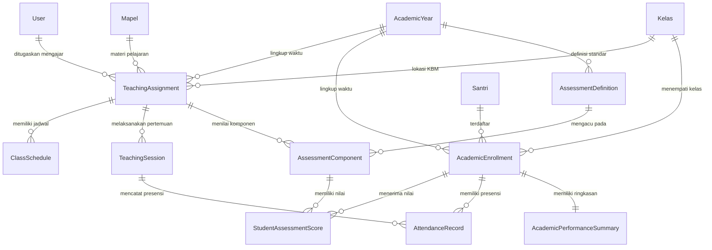

# Audit Domain Akademik Eksisting & Kesiapan Integrasi LMS

Dokumen ini memaparkan hasil audit menyeluruh terhadap arsitektur domain akademik eksisting DIGITREN pada Pondok Pesantren Fatimah Az-Zahra. Audit ini bertujuan untuk memetakan model, relasi, batas kepemilikan (*ownership boundaries*), titik integrasi (*integration points*), dan mengidentifikasi potensi konflik sebelum modul *Learning Management System* (LMS) diimplementasikan.

---

## 1. Inventaris Model & Layanan Domain Akademik Eksisting

Domain akademik DIGITREN terbagi dalam tiga pilar fondasi yang telah distabilkan pada fase 5.8.7 dan 5.8.8:

### 1.1 Fondasi Akademik (*Academic Foundation*)
| Model / Layanan | Tanggung Jawab & Entitas Data | Atribut Kunci |
| :--- | :--- | :--- |
| `AcademicYear` | Periode kalender akademik dan status semester aktif. | `id`, `name`, `semester` (Ganjil/Genap), `start_date`, `end_date`, `is_active` |
| `Kelas` | Rombongan belajar dan tingkat pendidikan formal santri. | `id`, `nama_kelas`, `tingkat`, `kapasitas` |
| `Mapel` | Master mata pelajaran kepesantrenan dan kurikulum formal. | `id`, `nama_mapel`, `kode_mapel`, `kategori`, `is_active` |
| `StudentBatch` | Kohort tahun angkatan santri masuk pondok. | `id`, `year`, `name` |
| `Santri` | Master profil kependudukan santri pesantren. | `id`, `nis`, `nama`, `jenis_kelamin`, `status` |
| `User` | Autentikasi dan otorisasi peran berbasis Spatie Permissions. | `id`, `name`, `email`, `role` (Admin, Guru, Santri, dll) |

### 1.2 Operasional KBM & Presensi (*Academic Operational*)
| Model / Layanan | Tanggung Jawab & Entitas Data | Atribut Kunci |
| :--- | :--- | :--- |
| `TeachingAssignment` | Surat Keputusan (SK) penugasan mengajar guru pada kelas & mapel tertentu di tahun ajaran aktif. | `id`, `user_id` (guru), `mapel_id`, `kelas_id`, `academic_year_id`, `status` |
| `AcademicEnrollment` | Pendaftaran aktif seorang santri ke dalam suatu kelas pada tahun ajaran tertentu. | `id`, `santri_id`, `kelas_id`, `academic_year_id`, `status` (Aktif/Nonaktif) |
| `ClassSchedule` | Alokasi slot jadwal pelajaran mingguan per penugasan mengajar. | `id`, `teaching_assignment_id`, `day_of_week`, `start_time`, `end_time`, `room` |
| `TeachingSession` | Pertemuan riil KBM tatap muka pada tanggal tertentu. | `id`, `teaching_assignment_id`, `session_date`, `topic`, `status` |
| `AttendanceRecord` | Catatan kehadiran santri per pertemuan KBM. | `id`, `teaching_session_id`, `academic_enrollment_id`, `status` (Hadir/Sakit/Izin/Alpha) |

### 1.3 Evaluasi & Penilaian (*Curriculum & Evaluation*)
| Model / Layanan | Tanggung Jawab & Entitas Data | Atribut Kunci |
| :--- | :--- | :--- |
| `AssessmentDefinition` | Definisi jenis evaluasi institusional per tahun ajaran (UTS, UAS, Tugas, Praktik). | `id`, `academic_year_id`, `name`, `type`, `weight`, `is_active` |
| `AssessmentComponent` | Instansiasi komponen penilaian oleh guru untuk penugasan ajar tertentu. | `id`, `teaching_assignment_id`, `assessment_definition_id`, `weight` |
| `StudentAssessmentScore` | Nilai mentah yang diperoleh santri pada komponen evaluasi tertentu. | `id`, `assessment_component_id`, `academic_enrollment_id`, `score`, `graded_by` |
| `AcademicPerformanceSummary` | Rekapitulasi agregat otomatis performa santri (tingkat kehadiran dan rata-rata tertimbang nilai). | `id`, `academic_enrollment_id`, `attendance_rate`, `average_score`, `computation_status` |
| `AssessmentService` | Layanan bisnis validasi bobot (total 100%), input nilai, dan integritas evaluasi. | *Transactional service logic* |
| `AcademicPerformanceService` | Layanan komputasi agregat kehadiran dan nilai tertimbang secara berkala. | *Aggregation engine* |

---

## 2. Diagram Relasi Domain Eksisting



---

## 3. Batas Kepemilikan Sistem (*Ownership Boundaries*)

Untuk menjaga arsitektur tetap bersih (*clean architecture*), sistem membatasi wewenang perubahan data sebagai berikut:

```
┌────────────────────────────────────────────────────────────────────────┐
│               BATAS KEPEMILIKAN DOMAIN (OWNERSHIP BOUNDARIES)           │
├──────────────────────────┬─────────────────────────────────────────────┤
│ Peran Pengguna           │ Tanggung Jawab & Hak Eksklusif              │
├──────────────────────────┼─────────────────────────────────────────────┤
│ 1. Administrator         │ • Membuat Mapel, Kelas, dan Tahun Ajaran.   │
│                          │ • Menerbitkan SK Mengajar (TeachingAssign). │
│                          │ • Menetapkan Definisi Penilaian Institusi.  │
│                          │ • Mengelola pendaftaran santri (Enrollment).│
├──────────────────────────┼─────────────────────────────────────────────┤
│ 2. Guru / Asatidz        │ • Membuka jurnal pertemuan (TeachingSession)│
│                          │ • Mengisi presensi santri (AttendanceRecord)│
│                          │ • Mengatur komponen nilai kelas ajar.       │
│                          │ • Memasukkan nilai santri (AssessmentScore).│
├──────────────────────────┼─────────────────────────────────────────────┤
│ 3. Santri                │ • Hak baca murni (*Read-Only*).             │
│                          │ • Melihat jadwal KBM, nilai, dan kehadiran. │
├──────────────────────────┼─────────────────────────────────────────────┤
│ 4. Pengurus              │ • Memantau agregat kehadiran & KBM.         │
│                          │ • Mengawasi kedisiplinan dan asrama.        │
└──────────────────────────┴─────────────────────────────────────────────┘
```

---

## 4. Titik Integrasi Alami Modul LMS (*LMS Integration Points*)

Modul LMS **tidak berdiri sendiri dari nol**, melainkan terintegrasi secara alami pada titik-titik sambung berikut:

### 4.1 Titik Masuk Guru: `TeachingAssignment`
- Guru tidak membuat kelas LMS secara manual (*tidak seperti Google Classroom umum di mana guru membuat kode kelas sendiri*).
- Konteks kelas ajar langsung diturunkan dari `TeachingAssignment` aktif.
- Bila seorang guru ditugaskan mengajar "Fiqih" di "Kelas VII-A" pada semester aktif, maka otomatis ruang bahan ajar untuk kelas tersebut tersedia di dasbor LMS guru.

### 4.2 Titik Masuk Santri: `AcademicEnrollment`
- Santri tidak memerlukan kode undangan (*class code*) untuk bergabung ke kelas materi.
- Santri yang terdaftar dalam `AcademicEnrollment` berstatus `Aktif` pada kelas tertentu otomatis mendapatkan akses ke seluruh bahan ajar yang ditargetkan untuk kelas tersebut.

### 4.3 Titik Masuk Kalender: `AcademicYear`
- Bahan ajar terikat pada tahun ajaran pembuatan, sehingga materi tahun ajaran lalu dapat diarsipkan secara elegan (*academic term isolation*).

---

## 5. Analisis Potensi Konflik & Mitigasi Arsitektural

| Potensi Konflik | Risiko Bila Salah Desain | Mitigasi Arsitektur DIGITREN |
| :--- | :--- | :--- |
| **1. Duplikasi Materi Antar Kelas Paralel** | Seorang guru mengajar Fiqih di Kelas VII-A dan VII-B. Jika materi terikat kaku 1-ke-1 pada `teaching_assignment_id`, guru terpaksa mengunggah berkas yang sama dua kali. | Dibuat tabel pemetaan `learning_material_targets`. Satu rekaman materi dapat ditautkan ke banyak rombel kelas. |
| **2. Tumpang Tindih Modul Penilaian (*Assessment Overlap*)** | Pengembang tergoda membuat fitur kuis atau penilaian tugas di LMS yang menghasilkan angka nilai sendiri, membingungkan modul `AssessmentComponent`. | **Penegasan Prinsip**: LMS murni berfungsi sebagai repositori bahan ajar (*Resource Library*). Penilaian tetap 100% berada di bawah wewenang `AssessmentComponent` dan `StudentAssessmentScore`. |
| **3. Ledakan Penyimpanan Server (*Disk Bloat*)** | Mengizinkan santri mengunggah tugas video/PDF dapat menghabiskan kuota penyimpanan server pesantren dalam satu semester. | Santri **tidak memiliki akses unggah**. Hanya guru terautentikasi yang dapat mengunggah berkas ajar dengan batasan ukuran berkas (*quota & mime limit*). |
| **4. Kebocoran Materi Antar Tingkat (*Cross-Class Leakage*)** | Santri kelas VII dapat melihat materi atau kisi-kisi ujian kelas IX. | Otorisasi ketat di level `LearningMaterialPolicy` memverifikasi bahwa `kelas_id` santri cocok dengan target distribusi materi. |

---

## 6. Kesimpulan Audit

Domain akademik eksisting DIGITREN memiliki fondasi relasional yang sangat solid, ternormalisasi, dan telah terlindungi oleh *policy* serta *service transaction*. Modul LMS dapat dipasang di atas `TeachingAssignment` dan `AcademicEnrollment` tanpa memerlukan migrasi ulang atau perubahan struktur tabel akademik yang sudah berjalan.
