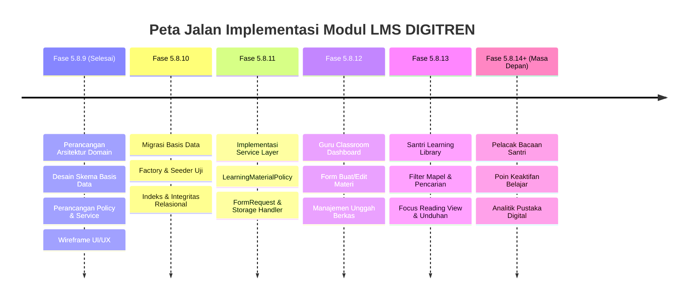

# Peta Jalan Pengembangan LMS DIGITREN (LMS Implementation Roadmap)

Dokumen ini menguraikan tahapan implementasi bertahap (*phased rollout*) modul *Learning Management System* (LMS) DIGITREN, dimulai dari persiapan skema basis data hingga peluncuran antarmuka penuh bagi guru dan santri.

---

## 1. Fase 5.8.10 — Implementasi Skema Basis Data (*Database Migration*)

**Tujuan**: Mewujudkan rancangan basis data menjadi tabel fisik yang aman, ternormalisasi, dan teruji.

### Rincian Pekerjaan:
1. **Membuat Migrasi Laravel**:
   - `create_learning_materials_table`: Kolom inti (`teacher_id`, `mapel_id`, `academic_year_id`, `title`, `slug`, `content_type`, `content`, `status`, `published_at`, `deleted_at`).
   - `create_learning_material_files_table`: Penyimpanan berkas lampiran dengan foreign key `CASCADE` ke `learning_materials`.
   - `create_learning_material_targets_table`: Pivot penargetan rombel kelas dengan `UNIQUE KEY` komposit (`learning_material_id`, `kelas_id`).
2. **Model Eloquent**:
   - `App\Models\LearningMaterial` lengkap dengan relasi `mapel()`, `teacher()`, `academicYear()`, `targets()`, `files()`, serta *scope* kueri (`scopePublished()`, `scopeForClass()`).
   - `App\Models\LearningMaterialFile` dengan metode helper ukuran bita yang terformat (`human_file_size`).
3. **Database Seeder & Factory**:
   - Membuat `LearningMaterialFactory` untuk keperluan otomatisasi *test suite*.
   - Membuat seeder contoh materi Fiqih, Nahwu, dan Hadits pada database demo.

---

## 2. Fase 5.8.11 — Lapisan Layanan & Otorisasi (*Service & Policy Layer*)

**Tujuan**: Membangun mesin bisnis yang aman, transaksional, dan menerapkan kontrol akses ketat.

### Rincian Pekerjaan:
1. **Kelas Layanan (`LearningMaterialService`)**:
   - Metode `createMaterial()`, `updateMaterial()`, `publishMaterial()`, `archiveMaterial()`.
   - Integrasi penyimpanan berkas fisik pada disk penyimpanan aman (`storage/app/materials`).
   - Penanganan slug unik otomatis dan pencegahan tabrakan penamaan.
2. **Kebijakan Keamanan (`LearningMaterialPolicy`)**:
   - Registrasi policy di `AuthServiceProvider`.
   - Penegakan wewenang guru (hanya mengelola materi buatannya sendiri pada mapel yang diampunya).
   - Penegakan wewenang santri (hanya melihat materi terbit pada rombel kelas terdaftarnya).
3. **Validasi Permintaan (*Form Requests*)**:
   - `StoreLearningMaterialRequest`: Validasi judul, mapel, tipe konten, dan pembatasan MIME berkas.
   - `UpdateLearningMaterialRequest`: Validasi izin ubah dan target kelas.
4. **Pengujian Fitur Backend (*Automated Feature Testing*)**:
   - Pengujian otorisasi: Guru A tidak boleh mengedit materi Guru B.
   - Pengujian pembatasan: Santri tidak boleh mengunggah berkas.
   - Pengujian integritas: Hapus materi membersihkan lampiran fisik.

---

## 3. Fase 5.8.12 — Antarmuka Guru (*Teacher Classroom UI*)

**Tujuan**: Menyediakan ruang kerja yang nyaman bagi dewan asatidz untuk mengunggah materi kajian.

### Rincian Pekerjaan:
1. **Dasbor Kelas Ajar Guru (`resources/views/pages/lms/teacher/index.blade.php`)**:
   - Tab navigasi kelas ajar berdasarkan SK Mengajar aktif guru.
   - Daftar kartu materi ajar dengan filter status (*Semua, Ditayangkan, Draf*).
   - Indikator ringkas unduhan santri dan jumlah lampiran berkas.
2. **Formulir Pengelolaan Materi (`create.blade.php` & `edit.blade.php`)**:
   - Form input judul materi dan ringkasan kajian.
   - Text editor bersih untuk catatan kitab dan materi teks.
   - Komponen multi-centang untuk membagikan materi ke kelas paralel (VII-A, VII-B, VII-C).
   - Kotak unggah berkas PDF/dokumen dengan indikator progres unggah.
   - Input tautan sematan YouTube dengan pratinjau instan.
3. **Integrasi Menu Navigasi**:
   - Menambahkan menu **"Bahan Ajar (LMS)"** pada bilah sisi (*sidebar*) akun peran Guru.

---

## 4. Fase 5.8.13 — Antarmuka Santri (*Student Learning Library*)

**Tujuan**: Membuka gerbang pustaka belajar mandiri bagi seluruh santri pesantren.

### Rincian Pekerjaan:
1. **Katalog Pustaka Digital (`resources/views/pages/lms/student/index.blade.php`)**:
   - Grid kartu materi yang responsif (tampilan kartu ramah ponsel dan tablet lab komputer).
   - Bilah pencarian kata kunci dan filter cepat berdasarkan mata pelajaran.
   - Lencana pembeda jenis konten (Kitab PDF, Video Kajian, Nadhom Teks).
2. **Halaman Pembaca Fokus (`read.blade.php`)**:
   - Tampilan baca artikel dengan tipografi terkalibrasi untuk kenyamanan retina.
   - Pemutar video responsif untuk tautan kajian YouTube.
   - Tombol unduh berkas modul pegangan dengan enkripsi rute aman (*Signed Route*).
3. **Integrasi Menu Navigasi**:
   - Menambahkan tab **"Pustaka Materi"** pada portal santri eksisting (`resources/views/pages/portal/santri.blade.php`).

---

## 5. Fase 5.8.14+ (Masa Depan) — Analitik & Pelacakan Bacaan (*Future Enhancements*)

**Tujuan**: Memberikan wawasan keaktifan santri kepada dewan guru tanpa membebani kinerja server.

### Fitur Opsional Masa Depan:
1. **Tabel Pelacak (`learning_material_views`)**:
   - Pencatatan santri yang telah membaca materi tertentu.
2. **Laporan Keaktifan Guru**:
   - Rekap santri di kelas yang belum membuka bahan ajar sebelum pertemuan KBM dimulai.
3. **Opsi Poin Keaktifan**:
   - Guru dapat menghubungkan keaktifan membaca materi dengan komponen penilaian formatif di buku nilai `AssessmentComponent`.
