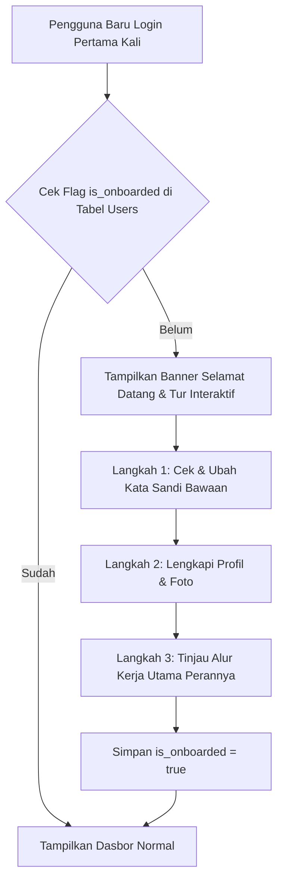

# Rencana Peningkatan Portal Dokumentasi Sistem (Documentation Portal Improvement Design)

Dokumen ini merumuskan rekomendasi pembaruan arsitektural dan antarmuka untuk portal panduan sistem (`/panduan`) di DIGITREN, berdasarkan evaluasi terhadap implementasi `DocumentationController` dan tampilan `resources/views/pages/documentation/index.blade.php`.

---

## 1. Tinjauan Portal Panduan Saat Ini (`/panduan`)

### Kondisi Saat Ini:
- **Pengendali Tunggal**: `DocumentationController::index()` mendeteksi peran utama pengguna (`$primaryRole`) dan mengirimkan tab aktif ke tampilan Blade.
- **Navigasi Tab Peran**: Menggunakan *Bootstrap Nav Pills* dengan pembatasan hak akses berbasis Spatie Permission (`@hasrole('Administrator')`, `@hasanyrole('Guru')`, dsb.).
- **Pencarian Lokal**: Terdapat kotak input pencarian `#doc_search` di bagian atas *Hero Banner*.
- **Penyimpanan Konten**: Konten panduan saat ini ditulis langsung (*hardcoded*) di dalam berkas Blade monolithic (`index.blade.php`, ~380 baris kode).

### Keterbatasan yang Ditemukan:
1. **Pemeliharaan Sulit (*Hard to Maintain*)**: Setiap penambahan alur kerja baru mengharuskan penyuntingan langsung pada kode HTML Blade.
2. **Pencarian Terbatas**: Pencarian berbasis JavaScript sederhana hanya menyaring elemen kartu yang tampil di tab aktif, belum memiliki kemampuan pencarian semantik atau indeks kata kunci lintas-peran.
3. **Belum Ada Alur Orientasi (*Onboarding Flow*)**: Pengguna baru (misal guru yang baru pertama kali login) belum diarahkan ke langkah-langkah penting yang harus dilakukan pertama kali (*guided walkthrough*).

---

## 2. Rekomendasi Struktur Menu Portal Dokumentasi

Untuk memudahkan penelusuran, panduan sistem di masa mendatang direkomendasikan mengadopsi struktur hierarki dua tingkat (*sidebar navigation + content reader*):

```
┌────────────────────────────────────────────────────────────────────────┐
│                        PORTAL PANDUAN SISTEM                           │
├────────────────────────┬───────────────────────────────────────────────┤
│ NAVIGASI MENU (KIRI)   │ AREA BACA DOKUMENTASI (KANAN)                 │
├────────────────────────┼───────────────────────────────────────────────┤
│ 🔍 Cari Topik / SOP... │ 📖 Panduan Penggunaan Sistem DIGITREN         │
│                        │                                               │
│ ▼ FONDASI SISTEM       │ [ Lencana: Administrator & Pengurus ]         │
│  • Pengenalan Sistem   │                                               │
│  • Hak Akses & Peran   │ Tanggal Terbit: September 2026                │
│  • Setup Awal Lembaga  │                                               │
│                        │ ### 1. Pendahuluan                            │
│ ▼ AKADEMIK & KBM       │ Sistem DIGITREN mengintegrasikan seluruh...   │
│  • Rantai Akademik     │                                               │
│  • Panduan Guru        │ [ Kotak Perhatian: Langkah Awal ]             │
│  • Panduan Santri      │ Pastikan Tahun Ajaran aktif telah dibuat...   │
│                        │                                               │
│ ▼ KEUANGAN PONDOK      │ ┌───────────────────────────────────────────┐ │
│  • Tabungan Santri     │ │ Langkah 1: Buka Menu Pengaturan           │ │
│  • Kasir & Uang Saku   │ │ Langkah 2: Masukkan Identitas Resmi       │ │
│                        │ └───────────────────────────────────────────┘ │
│ ▼ MANAJEMEN MATERI     │                                               │
│  • Unggah Berkas Kajian│ Apakah panduan ini membantu? [ 👍 Ya ] [ 👎 ] │
└────────────────────────┴───────────────────────────────────────────────┘
```

---

## 3. Dokumentasi Berbasis Peran (*Role-Based Segmentation*)

Portal dokumentasi harus secara cerdas memprioritaskan konten sesuai peran pengguna yang sedang login:

1. **Bila Pengguna Adalah Administrator / Pengurus**:
   - Menu default yang terbuka langsung: *Setup Awal Lembaga, Rantai Akademik, Pembuatan Kamar/Kelas, dan Dasbor Intelijen*.
2. **Bila Pengguna Adalah Guru / Asatidz**:
   - Menu default yang terbuka: *Tata Cara Presensi Sesi, Input Nilai Massal, dan Pengelolaan Materi Ajar*.
3. **Bila Pengguna Adalah Keuangan**:
   - Menu default yang terbuka: *Penerimaan Setoran Tabungan, Penarikan Uang Saku, dan Rekonsiliasi Kas Harian*.
4. **Bila Pengguna Adalah Santri / Wali Santri**:
   - Menu yang tampil disederhanakan: *Cara Mengecek Nilai, Memantau Presensi, Cek Saldo Tabungan, dan Mengunduh Kitab Materi*.

---

## 4. Peningkatan Fitur Pencarian Cerdas (*Search Capability*)

1. **Pencarian Terindeks Ringan (*Client-Side MiniSearch / Lunr.js*)**:
   - Seluruh berkas panduan diindeks dalam bentuk JSON ringkas (*search-index.json*) yang di-cache di peramban.
   - Ketika pengguna mengetik kata "absen" atau "sandi", sistem dapat langsung menampilkan potongan kalimat (*snippets*) dan rujukan bab yang tepat.
2. **Pencarian Cepat dengan Pintasan Kibor (*Keyboard Shortcut*)**:
   - Menekan tombol `Ctrl + K` (atau `Cmd + K`) langsung memunculkan jendela dialog pencarian modal dari halaman mana saja di dalam sistem.

---

## 5. Alur Orientasi Pengguna Baru (*Interactive Onboarding Flow*)

Bagi pengguna yang baru pertama kali masuk ke sistem:



### Manfaat Onboarding Flow:
- Mencegah asatidz kebingungan mencari tombol presensi saat pertama kali bertugas di kelas.
- Memastikan santri segera mengganti kata sandi bawaan demi keamanan akun pribadi.
- Menurunkan beban pertanyaan teknis berulang kepada staf Tata Usaha dan Administrator.
