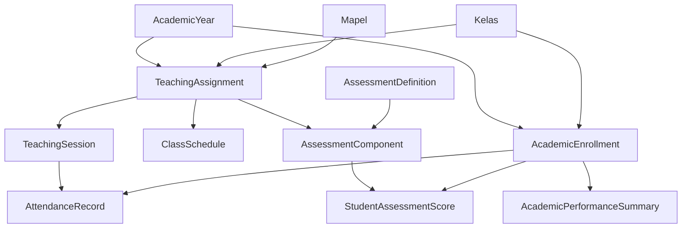

# DIGITREN — Academic System Project Roadmap

**System**: Sistem Informasi Pondok Pesantren Fatimah Az-Zahra (DIGITREN)  
**Baseline**: Laravel 12.69.2 | PHP 8.4.16 | MariaDB 10.4.32  
**Test Suite**: 279 passed tests, 1029 assertions  
**Tracking Board**: [GitHub Project #6](https://github.com/users/risky037/projects/6)  

---

## 1. Architecture Maturity Overview

The academic domain has evolved through rigorous phased refactoring into a modern, decoupled, multi-tier institutional management system.

---

## 2. Completed Phases

| Phase | Domain Title | Release Tag | Commit | Tests / Assertions | Key Delivery |
|---|---|---|---|---|---|
| **Phase 5.8.7C-7** | Academic Curriculum & Teaching Foundation | `phase-5.8.7C-7-completed` | `9fb2123f` | 192 / 762 | WaliKelasAssignments, Class-scoped Mapel, Temporal Teaching Assignments |
| **Phase 5.8.7C-8** | Academic Operational Foundation | `phase-5.8.7C-8-completed` | `bf6a282c` | 211 / 824 | ClassSchedules, AcademicCalendarEvents, TeachingSessions with lifecycle |
| **Phase 5.8.7C-9** | Attendance Domain Foundation | `phase-5.8.7C-9-completed` | `3ac87ef9` | 230 / 889 | AttendanceRecord per TeachingSession x AcademicEnrollment, AttendanceService |
| **Phase 5.8.7C-10** | Academic Evaluation Domain Foundation | `phase-5.8.7C-10-completed` | `b1935242` | 266 / 979 | AssessmentDefinitions, AssessmentComponents, StudentAssessmentScores, two-tier weights |
| **Phase 5.8.7C-11** | Academic Reporting & Analytics Foundation | `phase-5.8.7C-11-completed` | `e7e13035` | 279 / 1029 | AcademicPerformanceSummary aggregation cache, AcademicPerformanceService |

---

## 3. Current Phase

### Project Management Synchronization
- **Scope**: Align repository release history with GitHub Projects board #6, establish standardized label taxonomy, create Keep a Changelog documentation, and formalize project tracking guidelines.
- **Status**: IN PROGRESS / SYNCHRONIZING.

---

## 4. Upcoming Phases (Roadmap)

### [Phase 5.8.7C-12] Academic Administration & Export Foundation
- **Issue**: [#49](https://github.com/risky037/sistem-ponpes/issues/49)
- **Target Status**: TODO
- **Key Objectives**:
  - High-performance streaming data export for academic records.
  - Multi-format document generation (Excel `.xlsx` and PDF summary cards).
  - Administrative reporting matrices for school leadership and ministry reporting.
  - Multi-parameter academic filtering engine (combining year, grade level, gender, room, status).
  - Audit trail foundation for administrative interventions and overrides.

### [Phase 5.8.7D] Academic Intelligence Layer
- **Issue**: [#50](https://github.com/risky037/sistem-ponpes/issues/50)
- **Target Status**: TODO
- **Key Objectives**:
  - Longitudinal attendance and engagement analytics.
  - Teacher workload distribution, capacity metrics, and assignment optimization.
  - Institutional Academic Key Performance Indicators (KPIs) and telemetry.
  - Early-warning indicators for students requiring academic or pastoral intervention.

---

## 5. Domain Boundary Invariants

To prevent scope creep and maintain clean separation of concerns, the academic foundation strictly adheres to the following domain boundaries:

1. **No LMS Creep**: No student learning management systems (interactive quizzes, CBT, module downloads, or discussion boards) are placed within the academic foundation.
2. **No Premature Graduation/Rapor Engine**: Aggregations are calculated strictly as objective mathematical summaries (`AcademicPerformanceSummary`) without premature assumptions about final institutional report cards (*rapor*) or graduation algorithms.
3. **Auditability First**: Master records utilize `restrictOnDelete` foreign key constraints to prevent inadvertent cascading loss of historical academic data.
