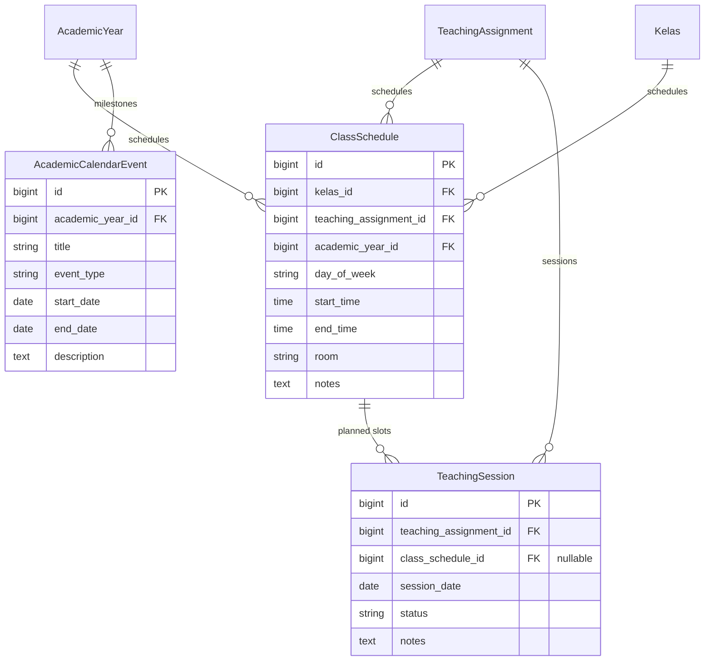

# Laporan Implementasi: Laravel 12 Academic Operational Foundation

**Fase**: Phase 5.8.7C-8  
**Status**: Completed  
**Tanggal**: 20 September 2026  
**Target Rilis**: `phase-5.8.7C-8-completed`  
**Lingkungan**: Laravel 12.x / PHP 8.2+ / MariaDB / Bootstrap 5 / Blade SSR  

---

## 1. Executive Summary

Fase 5.8.7C-8 berhasil membangun fondasi operasional akademik (*Academic Operational Foundation*) sebagai jembatan penting antara struktur kurikulum (Mapel, TeachingAssignment, WaliKelasAssignment) dan sistem pembelajaran digital di masa mendatang (*Learning Management System / LMS*).

Fokus utama fase ini mencakup tiga pilar inti operasional pesantren:
1. **Academic Schedule Domain (`class_schedules`)**: Penjadwalan alokasi jam belajar mingguan per kelas, penugasan guru/ustadz, dan ruangan.
2. **Academic Calendar Domain (`academic_calendar_events`)**: Pencatatan tonggak kalender akademik pesantren seperti awal semester, jadwal ujian, hari libur, dan kegiatan resmi.
3. **Teaching Session Foundation (`teaching_sessions`)**: Fondasi sesi pembelajaran riil/terencana per penugasan mengajar dengan manajemen siklus status terstruktur (*Planned*, *Completed*, *Cancelled*).

Implementasi mematuhi secara ketat batasan domain (*strict domain boundary*): **tidak mengimplementasikan fitur LMS** seperti absensi kehadiran santri (*attendance*), penilaian/rapor (*grading & report cards*), bank soal/ujian daring (*exams & question banks*), maupun manajemen materi/modul daring (*learning materials*).

---

## 2. Domain Architecture

Arsitektur operasional akademik dirancang mengikuti prinsip pemisahan tanggung jawab (*Separation of Concerns*) dan perlindungan integritas historis data:



### Karakteristik Domain
- **Historical Immutability**: Entitas `ClassSchedule` yang telah memiliki riwayat pertemuan `TeachingSession` tidak dapat dihapus sembarangan untuk mencegah hilangnya jejak audit akademik.
- **Foreign Key Protection**: Seluruh relasi kunci asing menggunakan relasi ketat `restrictOnDelete()`. Menghapus `Kelas` atau `AcademicYear` yang memiliki jadwal atau agenda kalender aktif akan ditolak oleh basis data dan controller guard.
- **Atomic Operations**: Perubahan dan pembuatan jadwal serta sesi pengajaran dieksekusi melalui service layer dalam transaksi basis data (`DB::transaction`).

---

## 3. Database Schema

Tabel operasional didefinisikan pada migrasi tunggal:
`database/migrations/2024_06_01_000004_create_academic_operational_tables.php`

### 3.1. Tabel `class_schedules`
| Kolom | Tipe Data | Modifiers | Keterangan |
|---|---|---|---|
| `id` | `bigint unsigned` | Auto Increment, PK | Identifikator jadwal |
| `kelas_id` | `bigint unsigned` | FK -> `kelas.id`, `restrictOnDelete` | Kelas yang dijadwalkan |
| `teaching_assignment_id` | `bigint unsigned` | FK -> `teaching_assignments.id`, `restrictOnDelete` | Penugasan guru & mapel |
| `academic_year_id` | `bigint unsigned` | FK -> `academic_years.id`, `restrictOnDelete` | Tahun ajaran terkait |
| `day_of_week` | `varchar(255)` | Not Null | Hari (Senin - Ahad) |
| `start_time` | `time` | Not Null | Jam mulai belajar |
| `end_time` | `time` | Not Null | Jam selesai belajar |
| `room` | `varchar(255)` | Nullable | Ruangan / lokasi gedung |
| `notes` | `text` | Nullable | Catatan jadwal |
| `created_at` / `updated_at` | `timestamp` | Nullable | Audit timestamp |

**Indeks & Constraint**:
- `UNIQUE(kelas_id, teaching_assignment_id, academic_year_id, day_of_week, start_time)` dengan nama constraint `class_schedules_slot_unique`. Mencegah tabrakan slot waktu yang sama persis untuk penugasan mengajar kelas tersebut.

### 3.2. Tabel `academic_calendar_events`
| Kolom | Tipe Data | Modifiers | Keterangan |
|---|---|---|---|
| `id` | `bigint unsigned` | Auto Increment, PK | Identifikator agenda |
| `academic_year_id` | `bigint unsigned` | FK -> `academic_years.id`, `restrictOnDelete` | Tahun ajaran agenda |
| `title` | `varchar(255)` | Not Null | Nama agenda/kegiatan |
| `event_type` | `varchar(255)` | Not Null | Kategori agenda |
| `start_date` | `date` | Not Null | Tanggal mulai |
| `end_date` | `date` | Not Null | Tanggal selesai |
| `description` | `text` | Nullable | Rincian agenda |
| `created_at` / `updated_at` | `timestamp` | Nullable | Audit timestamp |

**Validasi Tipe Agenda**:
- `Awal Semester`, `Libur`, `Ujian`, `Kegiatan`, `Lainnya`.

### 3.3. Tabel `teaching_sessions`
| Kolom | Tipe Data | Modifiers | Keterangan |
|---|---|---|---|
| `id` | `bigint unsigned` | Auto Increment, PK | Identifikator sesi |
| `teaching_assignment_id` | `bigint unsigned` | FK -> `teaching_assignments.id`, `restrictOnDelete` | Penugasan mengajar |
| `class_schedule_id` | `bigint unsigned` | Nullable, FK -> `class_schedules.id`, `restrictOnDelete` | Slot jadwal acuan |
| `session_date` | `date` | Not Null | Tanggal sesi terlaksana/dijadwalkan |
| `status` | `varchar(255)` | Default: `Planned` | Status (`Planned`, `Completed`, `Cancelled`) |
| `notes` | `text` | Nullable | Catatan pelaksanaan sesi |
| `created_at` / `updated_at` | `timestamp` | Nullable | Audit timestamp |

---

## 4. Model Relationships

| Model Asal | Nama Relasi | Tipe Relasi | Model Tujuan | Keterangan |
|---|---|---|---|---|
| `ClassSchedule` | `kelas()` | `BelongsTo` | `Kelas` | Kelas dari jadwal |
| `ClassSchedule` | `teachingAssignment()` | `BelongsTo` | `TeachingAssignment` | Penugasan guru & mapel |
| `ClassSchedule` | `academicYear()` | `BelongsTo` | `AcademicYear` | Tahun ajaran jadwal |
| `ClassSchedule` | `teachingSessions()` | `HasMany` | `TeachingSession` | Sesi riil yang berpatokan pada jadwal |
| `AcademicCalendarEvent` | `academicYear()` | `BelongsTo` | `AcademicYear` | Tahun ajaran agenda kalender |
| `TeachingSession` | `teachingAssignment()` | `BelongsTo` | `TeachingAssignment` | Penugasan mengajar sesi |
| `TeachingSession` | `classSchedule()` | `BelongsTo` | `ClassSchedule` | Slot jadwal acuan (bisa null jika sesi insidental) |
| `Kelas` | `classSchedules()` | `HasMany` | `ClassSchedule` | Seluruh jadwal pada kelas |
| `AcademicYear` | `classSchedules()` | `HasMany` | `ClassSchedule` | Seluruh jadwal pada tahun ajaran |
| `AcademicYear` | `calendarEvents()` | `HasMany` | `AcademicCalendarEvent` | Agenda kalender dalam tahun ajaran |
| `TeachingAssignment` | `classSchedules()` | `HasMany` | `ClassSchedule` | Jadwal mengajar untuk penugasan ini |
| `TeachingAssignment` | `teachingSessions()` | `HasMany` | `TeachingSession` | Riwayat sesi pembelajaran |

---

## 5. Service Layer

### 5.1. `AcademicScheduleService` (`app/Services/Academic/AcademicScheduleService.php`)
- `createSchedule(Kelas $kelas, TeachingAssignment $teachingAssignment, AcademicYear $academicYear, string $dayOfWeek, string $startTime, string $endTime, ?string $room = null, ?string $notes = null): ClassSchedule`:
  - Validasi bahwa `start_time` harus lebih awal dari `end_time`.
  - Validasi kesesuaian konsistensi kelas dan tahun ajaran antara objek terkait.
  - Pengecekan tabrakan jadwal ganda pada kelas & waktu yang sama.
  - Pembuatan record di dalam `DB::transaction`.
- `updateSchedule(ClassSchedule $schedule, array $data): ClassSchedule`:
  - Validasi urutan jam dan potensi duplikasi slot jika hari/jam diubah.
  - Update atomik via transaksi.
- `deleteSchedule(ClassSchedule $schedule): bool`:
  - **Integritas Historis**: Memeriksa keberadaan `TeachingSession` terhubung. Jika sudah memiliki riwayat sesi, proses dibatalkan dan melempar `DomainException` agar riwayat pembelajaran tidak hilang.

### 5.2. `TeachingSessionService` (`app/Services/Academic/TeachingSessionService.php`)
- `generateSession(TeachingAssignment $teachingAssignment, string $sessionDate, ?ClassSchedule $classSchedule = null, ?string $notes = null): TeachingSession`:
  - Memastikan jika slot jadwal dispesifikasikan, relasi penugasan mengajarnya harus cocok.
  - Menginisialisasi sesi dengan status `Planned`.
- `completeSession(TeachingSession $session, ?string $notes = null): TeachingSession`:
  - Transisi status menjadi `Completed`.
  - Mencegah sesi yang sudah dibatalkan (`Cancelled`) diselesaikan secara langsung tanpa validasi.
- `cancelSession(TeachingSession $session, ?string $notes = null): TeachingSession`:
  - Transisi status menjadi `Cancelled` disertai alasan/catatan pembatalan.

---

## 6. UI Components & Design System

Implementasi UI mematuhi panduan desain Pesantren Green:
- **Komponen Toolbar**: Seluruh view mengintegrasikan `<x-card-toolbar title="...">` dengan filter tahun ajaran, kelas, hari, dan tipe kegiatan.
- **Komponen Modal**: Menggunakan `<x-modal-form>` untuk form penambahan, `<x-edit-modal>` untuk form pengeditan, dan `<x-delete-modal>` untuk konfirmasi hapus data yang aman dan informatif.
- **Desain Responsif**: Tabel terintegrasi dengan DataTables server-side, responsive columns, dan badge status visual (`bg-primary`, `bg-danger`, `bg-warning`, `bg-info`, `bg-light text-dark border`).
- **Navigasi Sistem**: Terintegrasi pada sidebar navigasi `resources/views/components/navbar.blade.php` di bawah kelompok Data Akademik:
  - `Jadwal Pelajaran` (`bx bx-time-five`) -> `route('class-schedule.index')`
  - `Kalender Akademik` (`bx bx-calendar-event`) -> `route('academic-calendar-event.index')`

---

## 7. Validation Results

Semua verifikasi dan pipeline pengujian lolos tanpa catatan kesalahan (*All Green*):

```text
1. php artisan optimize:clear
   Config, route, cache, view berhasil dibersihkan.

2. php artisan migrate:fresh --seed
   17 migrasi berhasil diaplikasikan secara berurutan.
   Semua seeder (RolePermission, User, AcademicStructure, AcademicFoundation, Setting) tereksekusi sukses.

3. php artisan test
   Tests:    211 passed (836 assertions)
   Duration: 37.80s
   Cakupan pengujian baru:
   - Tests\Feature\Academic\ClassScheduleCrudTest (9 tests, 22 assertions)
   - Tests\Feature\Academic\AcademicCalendarEventTest (8 tests, 22 assertions)
   - Tests\Feature\Academic\TeachingSessionServiceTest (6 tests, 20 assertions)

4. npm run build
   Vite v4.4.9 berhasil memproduksi manifest dan aset produksi tanpa error.

5. composer run lint:check
   Pint PHP code style checker: PASSED (0 issues).

6. composer audit
   No security vulnerability advisories found.
```

---

## 8. Future LMS Boundary

Sebagai penegasan batasan arsitektur sebelum fase LMS dimulai:

| Fitur / Komponen | Status Saat Ini | Rencana Masa Depan |
|---|---|---|
| Master Jadwal Kelas | **Tersedia** (`class_schedules`) | Digunakan untuk generate sesi presensi |
| Master Kalender Akademik | **Tersedia** (`academic_calendar_events`) | Digunakan untuk validasi KBM & masa ujian |
| Sesi Pembelajaran | **Tersedia** (`teaching_sessions`) | Menjadi induk kehadiran kelas & jurnal mengajar ustadz |
| Presensi / Absensi Santri | **DILARANG / BELUM ADA** | Masuk ke domain LMS Presensi |
| Nilai / Gradebook | **DILARANG / BELUM ADA** | Masuk ke domain LMS Penilaian & Rapor |
| Materi & Tugas Daring | **DILARANG / BELUM ADA** | Masuk ke domain LMS Modul Pembelajaran |
| Bank Soal & Ujian | **DILARANG / BELUM ADA** | Masuk ke domain LMS Evaluasi & CBT |

---

## 9. Kesimpulan & Rekomendasi Checkpoint

Phase 5.8.7C-8 telah selesai secara komprehensif, teruji 100%, dan siap untuk dikonsolidasikan.
- **Rekomendasi Tag Git**: `phase-5.8.7C-8-completed`
- **Rekomendasi Commit Subject**: `feat(academic): implement academic operational foundation`
