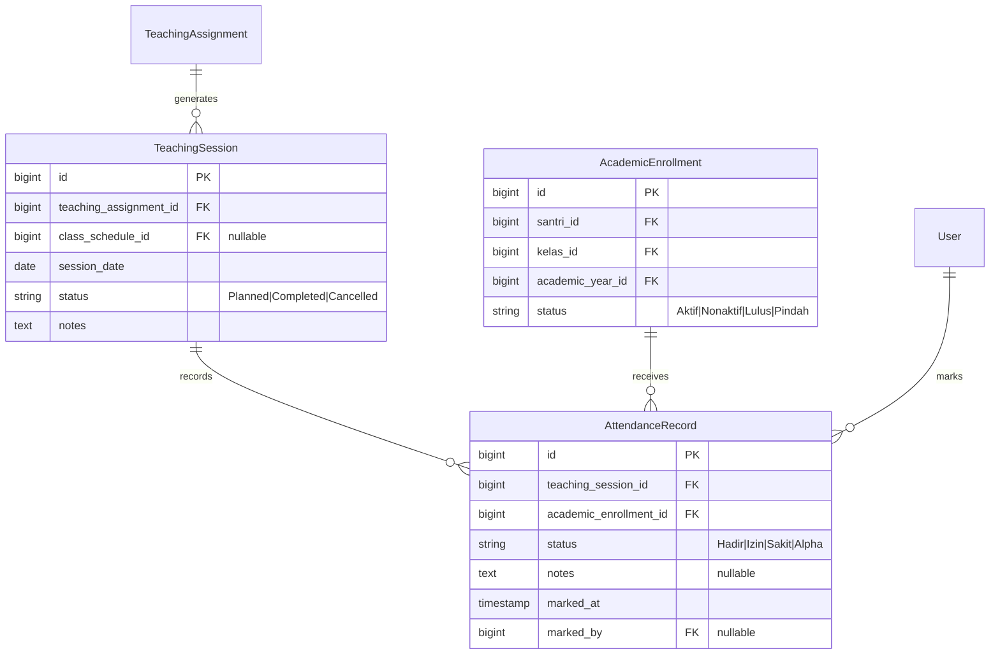

# Laporan Implementasi: Laravel 12 Attendance Domain Foundation

**Fase**: Phase 5.8.7C-9  
**Status**: Completed  
**Tanggal**: 20 September 2026  
**Target Rilis**: `phase-5.8.7C-9-completed`  
**Lingkungan**: Laravel 12.x / PHP 8.4+ / MariaDB 10.4.32 / Bootstrap 5.1.3 / Blade SSR  

---

## 1. Executive Summary

Fase 5.8.7C-9 memperkenalkan fondasi pencatatan kehadiran (*Attendance Domain Foundation*) pada **Sistem Informasi Pondok Pesantren Fatimah Az-Zahra**.

Domain ini menghubungkan sesi pengajaran nyata (*TeachingSession*) dengan santri terdaftar aktif melalui penempatan akademik (*AcademicEnrollment*). Implementasi ini menyediakan mekanisme presensi harian berbasis kelas bagi ustadz dan pengurus pesantren dengan akuntabilitas pencatatan, integritas historis, dan validasi domain yang kuat.

Fase ini mematuhi batasan arsitektur secara ketat: **tidak mengimplementasikan fitur LMS lanjutan** (seperti penilaian/rapor, modul pembelajaran, ujian/bank soal, maupun portal mandiri siswa).

---

## 2. Arsitektur Domain

### Karakteristik Arsitektur
1. **Historical Immutability & Accountability**:
   - `marked_by` merekam identitas ustadz atau admin pencatat presensi (`users.id`) dengan relasi `restrictOnDelete`.
   - `marked_at` mencatat stempel waktu pengisian atau pembaruan kehadiran.
   - Foreign key pada `teaching_session_id` dan `academic_enrollment_id` menggunakan `restrictOnDelete()` untuk mencegah penghapusan entitas induk jika data presensi telah terbentuk.
2. **Keterikatan Temporal**:
   - Presensi tidak dikaitkan langsung ke `Santri`, melainkan ke `AcademicEnrollment`. Dengan demikian, riwayat kehadiran santri di kelas dan tahun ajaran lampau tetap utuh sekalipun santri naik kelas, lulus, atau pindah.

---

## 3. Desain Skema Basis Data

File migrasi: `database/migrations/2024_06_01_000005_create_attendance_records_table.php`

### Tabel `attendance_records`
| Kolom | Tipe Data | Modifiers | Keterangan |
|---|---|---|---|
| `id` | `bigint unsigned` | Auto Increment, PK | Identifikator rekaman presensi |
| `teaching_session_id` | `bigint unsigned` | FK -> `teaching_sessions.id`, `restrictOnDelete` | Sesi pembelajaran acuan |
| `academic_enrollment_id` | `bigint unsigned` | FK -> `academic_enrollments.id`, `restrictOnDelete` | Penempatan santri aktif terkait |
| `status` | `varchar(255)` | Not Null | Status kehadiran (`Hadir`, `Izin`, `Sakit`, `Alpha`) |
| `notes` | `text` | Nullable | Catatan khusus (alasan izin/sakit) |
| `marked_at` | `timestamp` | Nullable | Waktu presensi dicatat/diubah |
| `marked_by` | `bigint unsigned` | Nullable, FK -> `users.id`, `restrictOnDelete` | Akun pencatat presensi |
| `created_at` / `updated_at` | `timestamp` | Nullable | Audit timestamp |

**Constraint & Indeks**:
- `UNIQUE(teaching_session_id, academic_enrollment_id)` dengan nama constraint `attendance_session_enrollment_unique`. Mencegah pencatatan ganda untuk santri yang sama pada satu sesi.

---

## 4. Model & Relasi

### Model `AttendanceRecord` (`app/Models/AttendanceRecord.php`)
- **Konstanta**:
  - `STATUS_HADIR = 'Hadir'`
  - `STATUS_IZIN = 'Izin'`
  - `STATUS_SAKIT = 'Sakit'`
  - `STATUS_ALPHA = 'Alpha'`
  - `ALLOWED_STATUSES = ['Hadir', 'Izin', 'Sakit', 'Alpha']`
- **Relasi**:
  - `teachingSession()` -> `BelongsTo(TeachingSession::class)`
  - `academicEnrollment()` -> `BelongsTo(AcademicEnrollment::class)`
  - `marker()` -> `BelongsTo(User::class, 'marked_by')`
- **Eloquent Scopes**:
  - `scopePresent()`: memfilter status `Hadir`.
  - `scopeAbsent()`: memfilter ketidakhadiran (`Izin`, `Sakit`, `Alpha`).
  - `scopeForSession($sessionId)`: memfilter rekaman berdasarkan sesi.

### Pembaruan Relasi Model Eksisting
- **`TeachingSession`**:
  - Menambahkan relasi `attendanceRecords()` dan alias `attendance_records()`.
- **`AcademicEnrollment`**:
  - Menambahkan relasi `attendanceRecords()` dan alias `attendance_records()`.

---

## 5. Service Layer & Business Invariants

Service: `app/Services/Academic/AttendanceService.php`

### Aturan Bisnis & Validasi
1. **Larangan Presensi Sesi Dibatalkan**:
   - Jika `TeachingSession::status === 'Cancelled'`, pencatatan kehadiran langsung ditolak dengan `DomainException`.
2. **Validasi Kecocokan Kelas**:
   - `AcademicEnrollment::kelas_id` harus sama persis dengan `TeachingAssignment::kelas_id` dari sesi.
3. **Validasi Kecocokan Tahun Ajaran**:
   - `AcademicEnrollment::academic_year_id` harus sama persis dengan `TeachingAssignment::academic_year_id` dari sesi.
4. **Validasi Keaktifan Santri**:
   - Santri harus memiliki enrollment berstatus `Aktif`.
5. **Validasi Kelengkapan Presensi**:
   - Method `completeAttendance(TeachingSession $session)` bertugas memvalidasi kelengkapan kehadiran (memastikan semua santri aktif telah diabsen) **tanpa mengubah status `TeachingSession` secara otomatis**.

---

## 6. Controller, Routing, & UI

### Controller: `AttendanceController` (`app/Http/Controllers/Academic/AttendanceController.php`)
- `index(Request $request)`: daftar sesi pembelajaran dengan filter tahun ajaran, kelas, dan status sesi, dilengkapi badge rekap kehadiran (`H`, `I`, `S`, `A`).
- `manage(TeachingSession $teachingSession)`: lembar presensi santri satu kelas dengan aksi cepat *Tandai Semua Hadir*.
- `store(Request $request, TeachingSession $teachingSession)`: penyimpanan presensi massal (*bulk*).
- `update(Request $request, AttendanceRecord $attendanceRecord)`: pembaruan data kehadiran individu.

### Views & Desain Pesantren Green
- `resources/views/pages/academic/attendance/index.blade.php`: tabel ikhtisar DataTables server-side dengan `<x-card-toolbar>`.
- `resources/views/pages/academic/attendance/manage.blade.php`: lembar presensi interaktif dengan status badges dan formulir terstruktur.
- `resources/views/components/navbar.blade.php`: menu navigasi *Presensi Kelas* (`bx bx-check-square`) di bawah menu akademik.

### Hak Akses (Permissions)
- Menambahkan grup permission `attendance`:
  - `attendance.index`
  - `attendance.create`
  - `attendance.update`
- Ditetapkan ke role `Administrator` dan `Pengurus`.

---

## 7. Hasil Validasi

| Pemeriksaan | Perintah | Status | Hasil |
|---|---|---|---|
| Pembersihan Cache | `php artisan optimize:clear` | **PASS** | Semua cache konfigurasi dan view bersih |
| Migrasi & Seeder | `php artisan migrate:fresh --seed` | **PASS** | 18 migrasi sukses, seeder izin sinkron |
| Test Suite | `php artisan test` | **PASS** | **230 passed (889 assertions)** |
| - AttendanceRecordTest | `AttendanceRecordTest.php` | **PASS** | 9 tests, 25 assertions |
| - AttendanceServiceTest | `AttendanceServiceTest.php` | **PASS** | 10 tests, 27 assertions |
| Frontend Asset Build | `npm run build` | **PASS** | Vite v4.4.9 build produksi sukses |
| PHP Linter & Style | `composer run lint:check` | **PASS** | Laravel Pint passed (0 violations) |
| Audit Keamanan | `composer audit` | **PASS** | 0 vulnerability advisories |

---

## 8. Batasan Domain LMS (*Strict LMS Boundary*)

| Fitur | Status Fase 5.8.7C-9 | Penjelasan Batasan |
|---|---|---|
| Pencatatan Kehadiran Santri | **SELESAI** | Menghubungkan sesi ke santri per kelas |
| Penilaian & Buku Nilai (*Gradebook*) | **BELUM / DILARANG** | Masuk ke domain LMS Evaluasi Akademik |
| Ujian & Bank Soal (*CBT*) | **BELUM / DILARANG** | Masuk ke domain LMS Ujian |
| Rapor Santri (*Report Cards*) | **BELUM / DILARANG** | Masuk ke domain Rapor & Kelulusan |
| Materi & Tugas Daring | **BELUM / DILARANG** | Masuk ke domain LMS E-Learning |
