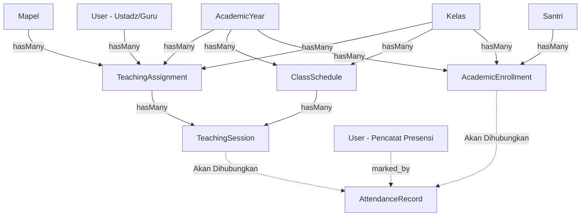

# Audit Pra-Implementasi: Laravel 12 Attendance Domain Foundation

**Fase**: Phase 5.8.7C-9  
**Status**: Pre-Implementation Assessment  
**Tanggal**: 20 September 2026  
**Baseline Git**: `phase-5.8.7C-8-completed`  
**Target Rilis**: `phase-5.8.7C-9-completed`  

---

## 1. Executive Summary

Fase 5.8.7C-9 bertujuan membangun fondasi domain pencatatan kehadiran (*Attendance Domain Foundation*) yang terhubung langsung dengan sesi pembelajaran (*TeachingSession*).

Domain ini merupakan jembatan operasional harian antara penugasan pengajar (*TeachingAssignment*), kelas (*Kelas*), dan penempatan santri aktif (*AcademicEnrollment*).

### Batasan Domain (*Strict Domain Boundary*)
Fase ini secara tegas **TIDAK MENGIMPLEMENTASIKAN**:
- Penilaian akademik (*grading / gradebook*)
- Bank soal dan ujian (*exams & question banks*)
- Rapor santri (*report cards*)
- Materi & modul daring (*learning materials*)
- Portal/Dashboard santri mandiri untuk LMS
- Pendaftaran santri per mata pelajaran individual (*student subject enrollment*)

---

## 2. Peta Relasi Eksisting (*Existing Relationship Map*)

Struktur domain operasional akademik yang telah aktif sejak Phase 5.8.7C-8:



### Karakteristik Entitas Terkait
1. **`TeachingSession`**:
   - Dimiliki oleh `TeachingAssignment` (`teaching_assignment_id`).
   - Merujuk opsional ke `ClassSchedule` (`class_schedule_id`).
   - Memiliki `session_date` dan `status` (`Planned`, `Completed`, `Cancelled`).
   - Melalui `TeachingAssignment`, sesi ini secara tidak langsung terikat ke `kelas_id` dan `academic_year_id`.
2. **`AcademicEnrollment`**:
   - Menghubungkan `santri_id` ke `kelas_id` dan `academic_year_id`.
   - Memiliki status penempatan (`Aktif`, `Nonaktif`, `Lulus`, `Pindah`).
3. **Integritas Penempatan**:
   - Santri yang berhak dicatat kehadirannya pada suatu `TeachingSession` adalah santri yang memiliki `AcademicEnrollment` berstatus `Aktif` pada `kelas_id` dan `academic_year_id` yang sama persis dengan `TeachingAssignment` dari sesi tersebut.

---

## 3. Desain Skema Basis Data (*Expected Schema Changes*)

### 3.1. Migrasi Baru: `2024_06_01_000005_create_attendance_records_table.php`
Urutan migrasi berjalan setelah `2024_06_01_000004_create_academic_operational_tables.php`.

```sql
CREATE TABLE attendance_records (
    id BIGINT UNSIGNED AUTO_INCREMENT PRIMARY KEY,
    teaching_session_id BIGINT UNSIGNED NOT NULL,
    academic_enrollment_id BIGINT UNSIGNED NOT NULL,
    status VARCHAR(255) NOT NULL,
    notes TEXT NULL,
    marked_at TIMESTAMP NULL,
    marked_by BIGINT UNSIGNED NULL,
    created_at TIMESTAMP NULL,
    updated_at TIMESTAMP NULL,
    CONSTRAINT attendance_records_teaching_session_id_foreign 
        FOREIGN KEY (teaching_session_id) REFERENCES teaching_sessions(id) ON DELETE RESTRICT,
    CONSTRAINT attendance_records_academic_enrollment_id_foreign 
        FOREIGN KEY (academic_enrollment_id) REFERENCES academic_enrollments(id) ON DELETE RESTRICT,
    CONSTRAINT attendance_records_marked_by_foreign 
        FOREIGN KEY (marked_by) REFERENCES users(id) ON DELETE RESTRICT,
    CONSTRAINT attendance_session_enrollment_unique 
        UNIQUE (teaching_session_id, academic_enrollment_id)
);
```

### 3.2. Penjelasan Atribut dan Keterbatasan
- `status`: dibatasi pada himpunan status valid: `Hadir`, `Izin`, `Sakit`, `Alpha`.
- `marked_at`: waktu presensi dicatat/diperbarui.
- `marked_by`: ID user (ustadz atau administrator/pengurus) yang melakukan presensi.
- `UNIQUE(teaching_session_id, academic_enrollment_id)`: menjamin satu santri hanya memiliki satu rekaman kehadiran per sesi pembelajaran.

---

## 4. Dependensi Kunci Asing & Risiko Data Historis

1. **`restrictOnDelete`**:
   - Jika `TeachingSession` dihapus (meskipun controller guard dan service layer melarang penghapusan sesi yang memiliki presensi), MariaDB akan menolak secara keras jika masih ada `attendance_records`.
   - `AcademicEnrollment` tidak boleh dihapus jika sudah memiliki rekaman presensi. Hal ini selaras dengan prinsip integritas historis akademik pesantren yang telah diterapkan pada fase 5.8.7C-6.
   - `User` (pencatat presensi) tidak boleh dihapus sembarangan jika terdapat rekaman presensi yang ditandatangani (`restrictOnDelete`).
2. **Risiko Tabrakan Data**:
   - Jika santri telah berpindah kelas di tengah semester (`AcademicEnrollment` nonaktif/pindah), rekaman presensi pada sesi-sesi terdahulu harus tetap aman dan merujuk ke enrollment historis santri tersebut.

---

## 5. Rencana Service Layer

Service baru: `app/Services/Academic/AttendanceService.php`
- `markAttendance(TeachingSession $session, AcademicEnrollment $enrollment, string $status, ?User $marker, ?string $notes): AttendanceRecord`
  - Validasi kelas dan tahun ajaran enrollment terhadap sesi.
  - Validasi status santri aktif.
  - Validasi status kehadiran valid (`Hadir`, `Izin`, `Sakit`, `Alpha`).
  - Eksekusi transaksi atomik `DB::transaction`.
- `bulkMarkAttendance(TeachingSession $session, array $records, ?User $marker): Collection`
  - Memproses daftar absensi seluruh santri di kelas tersebut secara massal dalam satu transaksi.
- `updateAttendance(AttendanceRecord $record, string $status, ?User $marker, ?string $notes): AttendanceRecord`
  - Memperbarui status presensi santri tertentu.
- `completeAttendance(TeachingSession $session, ?User $marker): void`
  - Memvalidasi bahwa seluruh santri terdaftar telah memiliki status kehadiran, kemudian memperbarui sesi jika diperlukan.

---

## 6. Rencana UI & Komponen

- Rute: `/attendance` atau `/academic/attendance`
- View: `resources/views/pages/academic/attendance/index.blade.php` (daftar sesi pembelajaran dan statistik ringkas kehadiran)
- View: `resources/views/pages/academic/attendance/manage.blade.php` (lembar presensi santri per sesi dengan radio/pilihan cepat `Hadir`/`Izin`/`Sakit`/`Alpha`)
- Reusable Blade: `<x-card-toolbar>`, `<x-status-badge>`, `<x-modal-form>`, `<x-delete-modal>`
- Desain: Pesantren Green design tokens (`--pesantren-primary: #157347`).

---

## 7. Kesimpulan Audit

Fondasi arsitektur dari Phase 5.8.7C-8 sangat siap untuk menampung entitas `attendance_records`. Semua dependensi entitas (`teaching_sessions`, `academic_enrollments`, `users`) telah memiliki struktur relasi yang kuat dan konsisten.
