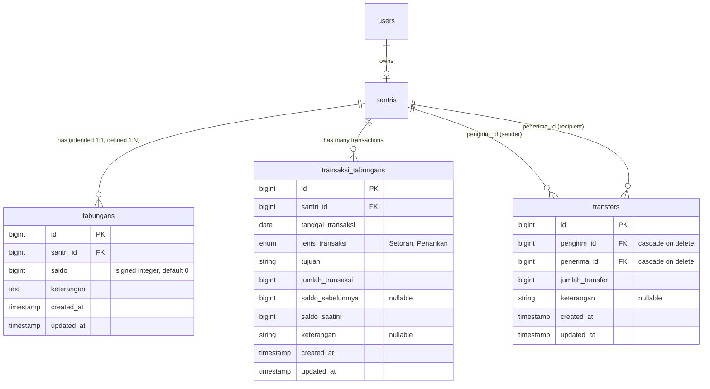

# Financial Transaction Reliability Assessment
**Project:** Sistem Informasi Pondok Pesantren Fatimah Az Zahra (`risky037/sistem-ponpes`)  
**Target Milestone:** Laravel 10 Production Stabilization (Pre-Laravel 11 Migration)  
**Assessor:** Senior Laravel Architect, Database Reliability Engineer, and Financial System Auditor  
**Date:** September 19, 2026  
**Related GitHub Issue:** [#19](https://github.com/risky037/sistem-ponpes/issues/19)

---

## 1. Executive Summary

A thorough architectural, code, schema, and concurrency audit was performed on the financial subsystems of the application, focusing on:
- `Tabungan` (Student Savings Accounts)
- `TransaksiTabungan` (Deposit & Withdrawal Ledger)
- `Transfer` (Inter-account Transfers)
- `SaldoDebit` (Account Management and Batch Initialization)
- Related Eloquent models, observers (`TransaksiTabunganObserver`), traits (`LogActivity`), and database migrations.

### Key Finding:
The financial system currently possesses **critical architectural vulnerabilities** that expose the institution to:
1. **Direct Financial Loss**: Concurrent withdrawal requests and transfer operations lack pessimistic database locking (`lockForUpdate`), allowing double-spend anomalies and negative account balances.
2. **Data Desynchronization & Partial Commits**: Mutations in `TransaksiController` and `SaldoDebitController` execute multi-table writes without `DB::transaction()`. In addition, `TransaksiController` attempts to update a non-existent database column (`tanggal_setor`), risking unhandled SQL failures.
3. **Severe Availability & Lock Contention Risks**: The `TransaksiTabunganObserver` executes synchronous external HTTP requests to a third-party WhatsApp gateway (`connect.labelin.co`) *inside* database transactions, keeping row locks and MySQL connections open for indeterminate network durations.
4. **Zero Automated Financial Test Coverage**: No automated unit or feature tests currently validate deposit integrity, withdrawal balance enforcement, transfer atomicity, or concurrency safety.

Stabilizing these financial mechanisms is an urgent prerequisite before proceeding with the Laravel 11 migration.

---

## 2. Current Architecture

### 2.1 Domain Model & Schema Relationship
The core financial domain consists of three primary tables and an auxiliary transfer ledger:



### 2.2 Operational Flow

1. **Deposit (`TransaksiController::store`)**:
   - Validates `santri_noinduk`, `debit` (min 50,000), `jenis_transaksi`.
   - Reads current `$tabungan->saldo` into memory.
   - Creates a `TransaksiTabungan` record.
   - Updates `$tabungan->saldo` and non-existent `$tabungan->tanggal_setor`.
   - **No transaction wrapper; no row locking.**

2. **Withdrawal (`TransaksiController::update`)**:
   - Validates `santri_noinduk`, `kredit` (min 10,000), `jenis_transaksi`.
   - Checks `if ($tabungan->saldo == 0)`.
   - Queries `TransaksiTabungan::whereDate('tanggal_transaksi', ...)->where('jenis_transaksi', 'Penarikan')->get()` **without filtering by `santri_id`**.
   - Creates a `TransaksiTabungan` record (omits `saldo_sebelumnya`).
   - Decrements `$tabungan->saldo`.
   - Calls `$this->send_message()` (via raw cURL) **in addition to** the observer's `Http::get()`.
   - **No transaction wrapper; no row locking.**

3. **Transfer (`TransferController::store` & `transfer`)**:
   - Validates input via `TransferRequest` (nominal does not enforce `gt:0`).
   - Checks `$pengirim->tabungan[0]->saldo < $jumlah` **outside** the transaction.
   - Dispatches `transfer()` wrapped in `DB::transaction()`:
     - Decrements sender balance in `tabungans`.
     - Creates sender `TransaksiTabungan` (Penarikan) -> **fires observer (sync HTTP call)**.
     - Increments recipient balance in `tabungans`.
     - Creates recipient `TransaksiTabungan` (Setoran) -> **fires observer (sync HTTP call)**.
     - Creates `Transfer` record.
   - **No row locking (`lockForUpdate()`); database locks held during 2 external HTTP requests.**

4. **Account Lifecycle (`SaldoDebitController`)**:
   - `store()`: Batch initializes accounts for all active santri or single santri without a database transaction.
   - `destroy()`: Deletes `Tabungan` and deletes `TransaksiTabungan` in two independent steps without a transaction.

---

## 3. Identified Problems

### Problem 1: Non-Atomic Financial Mutations (Missing `DB::transaction()`)
- **Location:** [TransaksiController.php](file:///home/adminfid/Documents/Projects/sistem-Ponpes-Fatimah-Az-Zahra/app/Http/Controllers/Transaksi/TransaksiController.php#L60-L94), [SaldoDebitController.php](file:///home/adminfid/Documents/Projects/sistem-Ponpes-Fatimah-Az-Zahra/app/Http/Controllers/Tabungan/SaldoDebitController.php#L38-L107)
- **Detail:** In `TransaksiController::store` and `update`, `TransaksiTabungan::create()` and `$tabungan->update()` occur as separate unmanaged operations. If the server crashes or an exception occurs between these statements (e.g. database disconnect or validation fault), the ledger record persists while the balance remains unmutated (or vice-versa), permanently destroying ledger-balance parity.

### Problem 2: Phantom Schema Column Update (`tanggal_setor`)
- **Location:** [TransaksiController.php lines 83 & 128](file:///home/adminfid/Documents/Projects/sistem-Ponpes-Fatimah-Az-Zahra/app/Http/Controllers/Transaksi/TransaksiController.php#L83)
- **Detail:** Both `store()` and `update()` execute:
  ```php
  $tabungan->update([
      'saldo' => ...,
      'tanggal_setor' => date('Y-m-d'),
  ]);
  ```
  Inspection of the `tabungans` migration confirms **`tanggal_setor` does not exist**. In standard SQL strict mode, this causes a fatal `PDOException: Column not found: Unknown column 'tanggal_setor'`.

### Problem 3: Lost Updates & Race Conditions (Missing `lockForUpdate()`)
- **Location:** `TransferController::transfer`, `TransaksiController::store`, `TransaksiController::update`
- **Detail:** All balance adjustments read the balance into PHP memory (`$tabungan->saldo`), compute the new balance in PHP (`$tabungan->saldo - $kredit`), and persist it via Eloquent `save()` or `update()`. If two concurrent requests arrive for the same account, both read the identical initial balance, resulting in a **Lost Update** where one transaction overwrites the other.

### Problem 4: Flawed Balance Validation & Negative Balance Permissibility
- **Location:** [TransaksiController.php line 109](file:///home/adminfid/Documents/Projects/sistem-Ponpes-Fatimah-Az-Zahra/app/Http/Controllers/Transaksi/TransaksiController.php#L109), [TransferRequest.php](file:///home/adminfid/Documents/Projects/sistem-Ponpes-Fatimah-Az-Zahra/app/Http/Requests/TransferRequest.php#L27)
- **Detail:**
  1. In `TransaksiController::update`, the balance check is:
     ```php
     if ($tabungan->saldo == 0) {
         Toastr::info('Saldo tidak cukup, saldo saat ini '.$tabungan->saldo);
     }
     ```
     If the santri has Rp 20,000 and requests a withdrawal of Rp 100,000, `$tabungan->saldo == 0` evaluates to `false`. The system proceeds, resulting in a balance of **-Rp 80,000**.
  2. `TransferRequest` defines `'nominal' => ['required', 'numeric']` without `min:1` or `gt:0`. A negative transfer amount would invert sender and receiver debits.
  3. The `tabungans` table defines `bigInteger('saldo')` (signed), so the database allows negative values without constraint violation.

### Problem 5: Global Lockout in Daily Withdrawal Limiter
- **Location:** [TransaksiController.php lines 113-116](file:///home/adminfid/Documents/Projects/sistem-Ponpes-Fatimah-Az-Zahra/app/Http/Controllers/Transaksi/TransaksiController.php#L113-L116)
- **Detail:**
  ```php
  $transaksi = new TransaksiTabungan;
  $tr_now = $transaksi->whereDate('tanggal_transaksi', now()->toDateString())->where('jenis_transaksi', 'Penarikan')->get();
  if (! $tr_now->isEmpty()) {
      Toastr::info('Santri dengan nomor induk '."$santri->no_induk".' telah selesai melakukan penarikan');
  }
  ```
  The query completely omits `where('santri_id', $santri->id)`. As soon as *any* student in the entire boarding school makes a withdrawal on a given date, **all subsequent withdrawals by all other students are blocked for the rest of the day**.

### Problem 6: Synchronous Third-Party HTTP Calls Inside Database Transactions
- **Location:** [TransaksiTabunganObserver.php lines 13-38](file:///home/adminfid/Documents/Projects/sistem-Ponpes-Fatimah-Az-Zahra/app/Observers/TransaksiTabunganObserver.php#L13-L38), [TransferController.php line 59](file:///home/adminfid/Documents/Projects/sistem-Ponpes-Fatimah-Az-Zahra/app/Http/Controllers/TransferController.php#L59)
- **Detail:**
  - `TransaksiTabunganObserver::created` calls `Http::get('https://connect.labelin.co/send-message', $param)`.
  - When a transfer executes inside `DB::transaction()`, **two** `TransaksiTabungan` records are created (`Penarikan` and `Setoran`).
  - The open database transaction and exclusive row locks are held open while waiting for two successive external HTTP requests. If the third-party endpoint experiences latency (e.g. 5-30 seconds) or outage, MySQL connection pools become exhausted, cascading into site-wide denial of service.
  - Furthermore, if the HTTP request times out or throws a connection exception, the database transaction rolls back, causing a valid transfer to fail solely because of an external notification failure.

### Problem 7: Duplicate Notification Dispatch
- **Location:** [TransaksiController.php line 130](file:///home/adminfid/Documents/Projects/sistem-Ponpes-Fatimah-Az-Zahra/app/Http/Controllers/Transaksi/TransaksiController.php#L130)
- **Detail:** During withdrawal in `TransaksiController::update()`, creating the `TransaksiTabungan` triggers `TransaksiTabunganObserver::created()` which sends an HTTP notification. Immediately following, line 130 invokes `$this->send_message()` which executes a raw `curl_exec` to the exact same external endpoint, sending duplicate WhatsApp messages to parents.

### Problem 8: Cascading Deletion of Financial Audit Records
- **Location:** [2024_05_20_231600_create_transfers_table.php](file:///home/adminfid/Documents/Projects/sistem-Ponpes-Fatimah-Az-Zahra/database/migrations/2024_05_20_231600_create_transfers_table.php#L17-L18), [SaldoDebitController.php line 130](file:///home/adminfid/Documents/Projects/sistem-Ponpes-Fatimah-Az-Zahra/app/Http/Controllers/Tabungan/SaldoDebitController.php#L130)
- **Detail:**
  - The `transfers` table specifies `cascadeOnDelete()` on `pengirim_id` and `penerima_id`. Deleting a student silently purges historical transfer records involving that student.
  - `SaldoDebitController::destroy` performs hard deletes on `TransaksiTabungan` records without soft delete or audit retention.

### Problem 9: Missing Unique Constraint on `tabungans.santri_id`
- **Location:** [2023_08_29_075224_create_tabungans_table.php](file:///home/adminfid/Documents/Projects/sistem-Ponpes-Fatimah-Az-Zahra/database/migrations/2023_08_29_075224_create_tabungans_table.php#L17), [Santri.php line 33](file:///home/adminfid/Documents/Projects/sistem-Ponpes-Fatimah-Az-Zahra/app/Models/Santri.php#L33)
- **Detail:** The relationship in `Santri.php` is defined as `hasMany(Tabungan::class)`, and the migration lacks a `unique()` index on `santri_id`. Concurrent account creation or repeated imports can create multiple tabungan accounts for a single student. In `TransferController`, the code blindly grabs `$pengirim->tabungan[0]`, which is non-deterministic if multiple records exist.

### Problem 10: Performance Bottlenecks & N+1 Queries
- **Location:** [SaldoDebitController.php line 19 & lines 26-31](file:///home/adminfid/Documents/Projects/sistem-Ponpes-Fatimah-Az-Zahra/app/Http/Controllers/Tabungan/SaldoDebitController.php#L19), [TransaksiController.php line 22-24](file:///home/adminfid/Documents/Projects/sistem-Ponpes-Fatimah-Az-Zahra/app/Http/Controllers/Transaksi/TransaksiController.php#L22-L24)
- **Detail:**
  - `SaldoDebitController::index` executes `$santri = Santri::all();` which loads all students into memory without ever using them.
  - DataTables in `SaldoDebitController::index` queries `$tabungan->santri->user->name` without eager loading `santri.user`, generating an N+1 query storm on large student datasets.

---

## 4. Risk Severity Matrix

| # | Issue | Severity | Business & Technical Impact | Recommendation |
|---|---|---|---|---|
| 1 | Missing `DB::transaction()` in deposits & withdrawals | **Critical** | Partial commits, orphaned transactions, ledger desynchronization. | Wrap all balance mutations in atomic transactions. |
| 2 | Missing pessimistic locking (`lockForUpdate`) | **Critical** | Lost updates, race conditions under concurrent requests, double withdrawals. | Implement `lockForUpdate()` on account retrieval before balance mutations. |
| 3 | Faulty withdrawal validation (`saldo == 0`) allowing negative balances | **Critical** | Direct financial loss; students can withdraw funds exceeding their balance. | Enforce `kredit <= current_saldo` in validation, controller, and DB constraint. |
| 4 | Synchronous HTTP calls inside database transactions | **Critical** | DB thread pool exhaustion, 500 errors, prolonged lock contention. | Decouple notifications from transactions using `DB::afterCommit` or queued jobs. |
| 5 | Non-existent column update (`tanggal_setor`) | **High** | Fatal SQL exceptions in strict mode; crashes transaction flows. | Remove `tanggal_setor` or create dedicated migration if required. |
| 6 | Global lockout bug in daily withdrawal limiter | **High** | System-wide withdrawal denial for all students after first student withdraws. | Add `where('santri_id', $santri->id)` to limiter query. |
| 7 | Duplicate notification dispatch on withdrawal | **High** | Double WhatsApp message charges, confused parents and administrators. | Consolidate notifications into a single listener/job. |
| 8 | Missing `UNIQUE` index on `tabungans.santri_id` | **High** | Duplicate savings accounts, non-deterministic balance calculations. | Add unique constraint to migration and convert relationship to `hasOne`. |
| 9 | Transfer cascade-delete destroys financial audit trail | **Medium** | Regulatory non-compliance; irrecoverable financial history upon student removal. | Use `restrictOnDelete()` and soft deletes for financial records. |
| 10 | Unindexed composite queries & N+1 in DataTables | **Medium** | Slow page loads, degraded database performance during peak hours. | Add composite index `(santri_id, tanggal_transaksi, jenis_transaksi)` and eager load relations. |

---

## 5. Proposed Remediation Roadmap

### Phase 1: Critical Reliability & Concurrency Remediation (PR #19A)
- **Transactions & Row Locking**:
  - Wrap `TransaksiController::store` and `TransaksiController::update` in `DB::transaction()`.
  - Use `Tabungan::where('santri_id', ...)->lockForUpdate()->firstOrFail()` for all balance reads.
  - Apply `lockForUpdate()` on both sender and recipient in `TransferController::transfer()`, ensuring ordered locking (e.g. by `santri_id` ascending) to eliminate potential deadlocks.
- **Balance Boundary Enforcement**:
  - Prevent negative balance: check `if ($tabungan->saldo < $kredit)` and return structured error.
  - Enforce `nominal > 0` in `TransferRequest`.
- **Bug Fixes**:
  - Remove reference to non-existent `tanggal_setor` column.
  - Fix daily withdrawal limiter in `TransaksiController::update` by scoping to `$santri->id`.

### Phase 2: Notification Decoupling & Observer Hardening (PR #19B)
- **Isolate External I/O**:
  - Refactor `TransaksiTabunganObserver` to use `DB::afterCommit(function () { ... })` or dispatch a queued job `SendTransactionNotification`.
  - Eliminate duplicate cURL call in `TransaksiController::update()`.
  - Add null safety checks for `WhatsappMessage` and `Setting` in the notification handler.

### Phase 3: Schema Hardening & Integrity Constraints (PR #19C)
- **Database Migrations**:
  - Add unique constraint to `tabungans.santri_id`.
  - Add `CHECK (saldo >= 0)` constraint or unsigned column definition on `tabungans.saldo`.
  - Add composite index on `transaksi_tabungans (santri_id, tanggal_transaksi, jenis_transaksi)`.
  - Modify `transfers` foreign keys to `restrictOnDelete()`.
- **Model Alignment**:
  - Update `Santri::tabungan()` from `hasMany` to `hasOne`.

### Phase 4: Query Optimization & Complete Test Suite (PR #19D)
- **Performance**:
  - Remove dead query `$santri = Santri::all();` in `SaldoDebitController::index()`.
  - Fix N+1 queries by eager loading `santri.user` in DataTables queries.
- **Automated Verification**:
  - Implement full test suite `tests/Feature/Financial/FinancialReliabilityTest.php` covering atomicity, concurrency, rollback on error, negative balance prevention, and observer isolation.

---

## 6. Migration Risk Assessment toward Laravel 11

| Aspect | Laravel 10 (Current) | Laravel 11 Impact | Risk Severity |
|---|---|---|---|
| **Pessimistic Locking in Transactions** | Standard `DB::transaction` and `lockForUpdate()`. | Identical behavior, but SQLite testing environment handles locks differently (SQLite table locking). | **Low** (Must ensure tests pass on MySQL/MariaDB and SQLite). |
| **Model Observers & Queued Events** | Observers are registered in `AppServiceProvider`. | In Laravel 11, `EventServiceProvider` is eliminated; events/observers register in `AppServiceProvider` or via model `#[ObservedBy]` attribute. | **Medium** (Decoupling observers now avoids migration friction). |
| **Silent Missing Column Updates** | In Laravel 10, updating unlisted columns might be ignored or fail depending on strict mode. | Laravel 11 enforces stricter model attribute handling. Non-existent column `tanggal_setor` will trigger exceptions consistently. | **High** (Must be removed immediately). |
| **Database Migrations & SQLite Driver** | Laravel 10 supports classic migrations. | Laravel 11 has modernized schema builder with native foreign key and check constraint handling. Adding proper check constraints now ensures compatibility. | **Low**. |

---

## 7. Recommended Implementation Plan

### 7.1 Files to Modify
1. [app/Http/Controllers/Transaksi/TransaksiController.php](file:///home/adminfid/Documents/Projects/sistem-Ponpes-Fatimah-Az-Zahra/app/Http/Controllers/Transaksi/TransaksiController.php)
2. [app/Http/Controllers/TransferController.php](file:///home/adminfid/Documents/Projects/sistem-Ponpes-Fatimah-Az-Zahra/app/Http/Controllers/TransferController.php)
3. [app/Http/Controllers/Tabungan/SaldoDebitController.php](file:///home/adminfid/Documents/Projects/sistem-Ponpes-Fatimah-Az-Zahra/app/Http/Controllers/Tabungan/SaldoDebitController.php)
4. [app/Observers/TransaksiTabunganObserver.php](file:///home/adminfid/Documents/Projects/sistem-Ponpes-Fatimah-Az-Zahra/app/Observers/TransaksiTabunganObserver.php)
5. [app/Models/Santri.php](file:///home/adminfid/Documents/Projects/sistem-Ponpes-Fatimah-Az-Zahra/app/Models/Santri.php)
6. [app/Http/Requests/TransferRequest.php](file:///home/adminfid/Documents/Projects/sistem-Ponpes-Fatimah-Az-Zahra/app/Http/Requests/TransferRequest.php)

### 7.2 Database Changes (New Migration)
- Create `database/migrations/xxxx_xx_xx_harden_financial_tables.php`:
  - Add unique constraint to `tabungans.santri_id`.
  - Add composite index on `transaksi_tabungans (santri_id, tanggal_transaksi, jenis_transaksi)`.
  - Update `transfers` foreign keys to avoid accidental cascade deletion.

### 7.3 Test Strategy
Create `tests/Feature/Financial/FinancialReliabilityTest.php` to verify:
1. **Deposit Atomicity**: Simulated database error during balance update rolls back `TransaksiTabungan`.
2. **Withdrawal Atomicity**: Simulated database error rolls back `TransaksiTabungan` and leaves balance intact.
3. **Insufficient Balance Rejection**: Attempted withdrawal exceeding balance returns error notification and does not mutate balance.
4. **Transfer Integrity**: Sender debited, recipient credited, transfer record created; if recipient credit fails, sender is not debited.
5. **Ordered Locking**: Transfer between Santri A and Santri B acquires locks in ascending ID order to prevent deadlocks.
6. **Notification Isolation**: Mocked external HTTP failure does not trigger database transaction rollback.

### 7.4 Rollback Strategy
- Every code modification will be partitioned into atomic git commits on dedicated feature branches.
- Database migrations will implement strict `down()` methods reversing index additions and constraint alterations.
- Continuous verification against the complete 46-test regression suite after each step.
