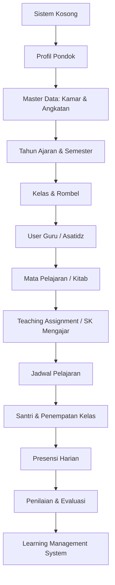

# 00. Mulai Dari Sini: Panduan Orientasi Awal DIGITREN

Selamat datang di platform **DIGITREN** (Sistem Informasi Manajemen Terpadu Pondok Pesantren Fatimah Az-Zahra). Dokumen ini merupakan gerbang utama (*starting point*) bagi seluruh pengguna baru untuk memahami cara kerja sistem, urutan inisialisasi, dan alur operasional pesantren.

---

## 1. Apa itu DIGITREN

**DIGITREN** adalah aplikasi tata kelola pesantren modern berbasis web yang dirancang khusus untuk memadukan administrasi kepesantrenan tradisional dan formal dalam satu platform yang aman, transparan, dan mudah digunakan.

Aplikasi ini mengintegrasikan:
- **Kependudukan Santri & Asrama**: Biodata santri, penempatan kamar santri, dan kohort angkatan.
- **Akademik & Kurikulum Pesantren**: Kalender tahun ajaran, jadwal KBM, penugasan mengajar guru (*SK Mengajar*), dan absensi harian.
- **Evaluasi & Penilaian**: Buku nilai santri terstruktur, pembobotan ujian otomatis (UTS, UAS, Tugas, Praktik), dan kalkulasi performa santri.
- **Keuangan Terkendali**: Tabungan induk santri dan uang saku belanja harian untuk mencegah kehilangan uang tunai di asrama.
- **Pustaka Belajar (LMS)**: Distribusi berkas materi PDF kitab kuning dan referensi kajian dari dewan guru.

---

## 2. Siapa yang Harus Melakukan Setup Pertama Kali?

> [!IMPORTANT]
> **Peran Penanggung Jawab Inisialisasi: Administrator Pesantren**
> Pada saat sistem baru dipasang (*fresh installation*), seluruh basis data masih kosong. Pengguna pertama yang wajib masuk ke sistem adalah **Administrator**. Administrator bertanggung jawab menyiapkan profil pondok dan fondasi data sebelum akun pengurus, guru, dan santri dapat digunakan secara normal.

Bila Anda adalah:
- **Guru / Asatidz**: Anda tidak perlu melakukan pengaturan sistem awal. Tunggu Administrator menerbitkan SK Mengajar Anda, lalu buka [Panduan Pertama Guru / Asatidz](file:///home/adminfid/Documents/Projects/sistem-Ponpes-Fatimah-Az-Zahra/docs/user-guide/onboarding/02-guru-first-use.md).
- **Santri / Wali Santri**: Anda dapat langsung masuk menggunakan NIS dan sandi resmi untuk melihat kamar, kelas, dan tabungan Anda pada [Panduan Pertama Santri](file:///home/adminfid/Documents/Projects/sistem-Ponpes-Fatimah-Az-Zahra/docs/user-guide/onboarding/03-santri-first-use.md).
- **Staf Keuangan**: Pelajari alur setoran dan penarikan kas santri pada [Panduan Pertama Keuangan](file:///home/adminfid/Documents/Projects/sistem-Ponpes-Fatimah-Az-Zahra/docs/user-guide/onboarding/05-keuangan-first-use.md).
- **Dewan Pengurus**: Pantau kedisiplinan dan laporan santri melalui [Panduan Pertama Pengurus](file:///home/adminfid/Documents/Projects/sistem-Ponpes-Fatimah-Az-Zahra/docs/user-guide/onboarding/04-pengurus-first-use.md).

---

## 3. Urutan Penggunaan Sistem: Dari Kondisi Kosong ke Operasional

Untuk mencegah kesalahan integritas data (*data dependency*), inisialisasi sistem wajib mengikuti urutan berantai berikut:

### Penjelasan Langkah Berantai:
1. **Profil Pondok (`Setting`)**: Mengisi nama pesantren, logo, alamat, dan nomor kontak resmi lembaga.
2. **Master Data (`Kamar` & `StudentBatch`)**: Mendaftarkan gedung asrama dan tahun angkatan santri.
3. **Tahun Ajaran (`AcademicYear`)**: Membuka periode kalender pendidikan aktif (misal: 2026/2027 Ganjil).
4. **Kelas Rombel (`Kelas`)**: Menyiapkan rombongan belajar (VII-A, VII-B, Takhasus Kitab).
5. **Akun Guru (`User` role Guru)**: Membuatkan akun asatidz pengampu.
6. **Mata Pelajaran (`Mapel`)**: Mendaftarkan kitab kajian (Fiqih, Nahwu, Hadits) dan pelajaran formal.
7. **SK Mengajar (`TeachingAssignment`)**: Mengaitkan Guru + Mapel + Kelas + Tahun Ajaran.
8. **Jadwal Pelajaran (`ClassSchedule`)**: Menetapkan hari, jam belajar, dan ruangan.
9. **Penempatan Santri (`AcademicEnrollment`)**: Memasukkan santri ke dalam rombel kelas aktif.
10. **Presensi Harian (`TeachingSession` & `AttendanceRecord`)**: Asatidz mengisi jurnal tatap muka di kelas.
11. **Evaluasi Belajar (`AssessmentComponent` & `StudentAssessmentScore`)**: Penginputan nilai tugas, ujian, dan rapor.
12. **Materi Belajar (LMS)**: Distribusi modul bacaan dan berkas kitab digital kepada santri binaan.

::: tip
Untuk memulai proses setup teknis pertama kali secara detail, silakan buka dokumen **[01. Panduan Pertama Administrator](file:///home/adminfid/Documents/Projects/sistem-Ponpes-Fatimah-Az-Zahra/docs/user-guide/onboarding/01-administrator-first-setup.md)**.
:::
